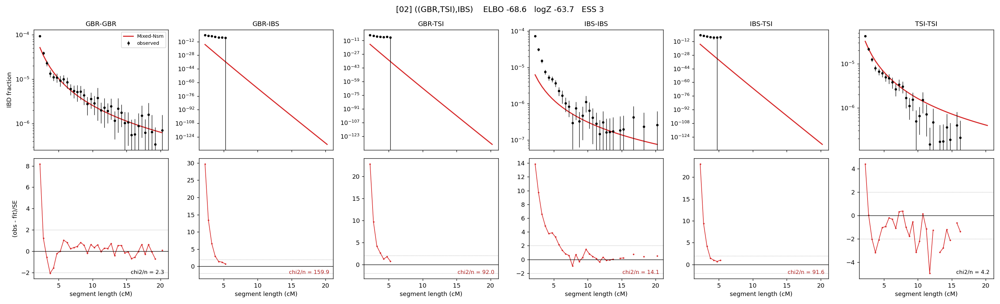

# `((GBR,TSI),IBS)`

Model 02 of 21 | tree (no admixture) | 2 events, 5 nodes

## Model score

| quantity | value | |
|---|---|---|
| ELBO | -68.56 | +- 0.08 (MC) |
| logZ (importance sampling) | -63.72 | |
| ESS of the IS weights | 2.5 / 4000 | LOW -- treat logZ with suspicion |
| Stan dropped-constant correction | -13.81 | already applied |
| seed kept / runtime | 47 | 12 s |

## Events (in temporal order, most recent first)

| # | type | detail | time (gen) | cumulative |
|---|---|---|---|---|
| 1 | MERGE | GBR + TSI -> n1 | 791.7 +- 17.3 | 791.7 |
| 2 | MERGE | n1 + IBS -> root | 1.3 +- 0.5 | 793.0 |

## Effective sizes (haploid)

| node | Ne | sd of log Ne |
|---|---|---|
| `GBR` | 195,074 | 0.03 |
| `IBS` | 1,617,588 | 0.10 |
| `TSI` | 308,610 | 0.03 |
| `n1` | 47,176 | 0.14 |
| `root` | 43,971 | 0.14 |

log-Ne random-walk step scale tau = 0.780

## Fit quality by component

| component | log-likelihood | n terms | chi2/n |
|---|---|---|---|
| IBD | -22.0 | 113 | 26.64 |
| SNP | +9.4 | 6 | 15.87 |

chi2/n is the mean squared standardized residual: 1.0 = fits inside its own SEs. Do NOT compare the two log-likelihood LEVELS against each other -- different term counts and different units.

## SNP covariance residuals `(w_hat - W_pred)/w_se`

| | GBR | IBS | TSI |
|---|---|---|---|
| **GBR** | +1.81 | +4.45 | -4.69 |
| **IBS** | +4.45 | -5.28 | +1.01 |
| **TSI** | -4.69 | +1.01 | +4.01 |

