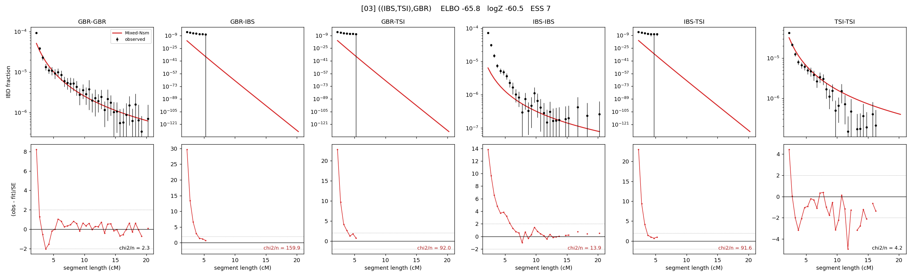

# `((IBS,TSI),GBR)`

Model 03 of 21 | tree (no admixture) | 2 events, 5 nodes

## Model score

| quantity | value | |
|---|---|---|
| ELBO | -65.80 | +- 0.16 (MC) |
| logZ (importance sampling) | -60.46 | |
| ESS of the IS weights | 7.1 / 4000 | LOW -- treat logZ with suspicion |
| Stan dropped-constant correction | -13.81 | already applied |
| seed kept / runtime | 23 | 10 s |

## Events (in temporal order, most recent first)

| # | type | detail | time (gen) | cumulative |
|---|---|---|---|---|
| 1 | MERGE | IBS + TSI -> n1 | 793.0 +- 21.4 | 793.0 |
| 2 | MERGE | GBR + n1 -> root | 1.2 +- 0.2 | 794.2 |

## Effective sizes (haploid)

| node | Ne | sd of log Ne |
|---|---|---|
| `GBR` | 195,932 | 0.04 |
| `IBS` | 1,580,107 | 0.10 |
| `TSI` | 309,205 | 0.03 |
| `n1` | 57,329 | 0.21 |
| `root` | 54,260 | 0.20 |

log-Ne random-walk step scale tau = 0.613

## Fit quality by component

| component | log-likelihood | n terms | chi2/n |
|---|---|---|---|
| IBD | -20.3 | 113 | 26.61 |
| SNP | +11.4 | 6 | 15.18 |

chi2/n is the mean squared standardized residual: 1.0 = fits inside its own SEs. Do NOT compare the two log-likelihood LEVELS against each other -- different term counts and different units.

## SNP covariance residuals `(w_hat - W_pred)/w_se`

| | GBR | IBS | TSI |
|---|---|---|---|
| **GBR** | +1.69 | +4.47 | -4.55 |
| **IBS** | +4.47 | -5.03 | +0.69 |
| **TSI** | -4.55 | +0.69 | +4.02 |

