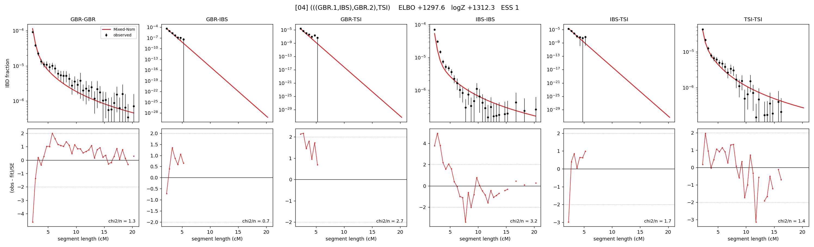

# `(((GBR.1,IBS),GBR.2),TSI)`

Model 04 of 21 | admixed leaf: **GBR** | 4 events, 8 nodes

## Model score

| quantity | value | |
|---|---|---|
| ELBO | +1297.59 | +- 0.17 (MC) |
| logZ (importance sampling) | +1312.34 | |
| ESS of the IS weights | 1.1 / 4000 | LOW -- treat logZ with suspicion |
| Stan dropped-constant correction | -25.77 | already applied |
| seed kept / runtime | 7 | 22 s |

## Events (in temporal order, most recent first)

| # | type | detail | time (gen) | cumulative |
|---|---|---|---|---|
| 1 | ADMIXTURE | GBR -> GBR.1 + GBR.2 | 147.5 +- 1.3 | 147.5 |
| 2 | MERGE | GBR.2 + IBS -> n1 | 11.7 +- 0.2 | 159.2 |
| 3 | MERGE | GBR.1 + n1 -> n2 | 1.3 +- 0.0 | 160.5 |
| 4 | MERGE | n2 + TSI -> root | 9.5 +- 0.1 | 170.0 |

## Admixture fraction

**f = 0.503 +- 0.004** (fraction from `GBR.1`; 0.497 from `GBR.2`)

## Effective sizes (haploid)

| node | Ne | sd of log Ne |
|---|---|---|
| `GBR` | 268,908 | 0.05 |
| `IBS` | 765,808 | 0.14 |
| `TSI` | 453,963 | 0.05 |
| `GBR.1` | 1,055 | 0.03 |
| `GBR.2` | 6,164 | 0.04 |
| `n1` | 6,068 | 0.05 |
| `n2` | 3,992 | 0.04 |
| `root` | 9,869 | 0.02 |

log-Ne random-walk step scale tau = 1.614

## Fit quality by component

| component | log-likelihood | n terms | chi2/n |
|---|---|---|---|
| IBD | +1,375.0 | 113 | 1.99 |
| SNP | +40.3 | 6 | 5.55 |

chi2/n is the mean squared standardized residual: 1.0 = fits inside its own SEs. Do NOT compare the two log-likelihood LEVELS against each other -- different term counts and different units.

## SNP covariance residuals `(w_hat - W_pred)/w_se`

| | GBR | IBS | TSI |
|---|---|---|---|
| **GBR** | +1.27 | +1.28 | -2.26 |
| **IBS** | +1.28 | -2.89 | +1.92 |
| **TSI** | -2.26 | +1.92 | +1.29 |

