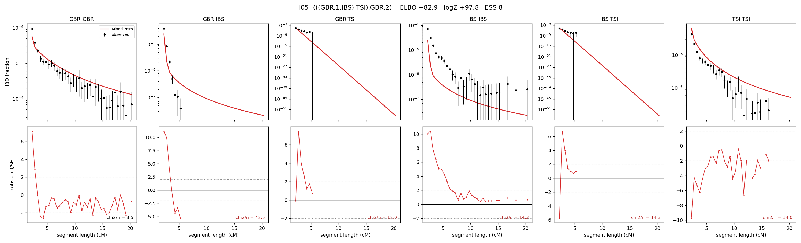

# `(((GBR.1,IBS),TSI),GBR.2)`

Model 05 of 21 | admixed leaf: **GBR** | 4 events, 8 nodes

## Model score

| quantity | value | |
|---|---|---|
| ELBO | +82.90 | +- 0.23 (MC) |
| logZ (importance sampling) | +97.77 | |
| ESS of the IS weights | 8.3 / 4000 | LOW -- treat logZ with suspicion |
| Stan dropped-constant correction | -25.77 | already applied |
| seed kept / runtime | 23 | 24 s |

## Events (in temporal order, most recent first)

| # | type | detail | time (gen) | cumulative |
|---|---|---|---|---|
| 1 | ADMIXTURE | GBR -> GBR.1 + GBR.2 | 1.0 +- 0.0 | 1.0 |
| 2 | MERGE | GBR.2 + IBS -> n1 | 1.0 +- 0.0 | 2.0 |
| 3 | MERGE | n1 + TSI -> n2 | 318.4 +- 1.4 | 320.4 |
| 4 | MERGE | GBR.1 + n2 -> root | 1.7 +- 0.2 | 322.1 |

## Admixture fraction

**f = 0.022 +- 0.001** (fraction from `GBR.1`; 0.978 from `GBR.2`)

Collapsed to a tree: one source carries <5% of the ancestry, so this graph is behaving as its no-admixture special case.

## Effective sizes (haploid)

| node | Ne | sd of log Ne |
|---|---|---|
| `GBR` | 4,521,741 | 0.28 |
| `IBS` | 5,824,897 | 0.28 |
| `TSI` | 237,596 | 0.05 |
| `GBR.1` | 37 | 0.10 |
| `GBR.2` | 5,861,161 | 0.28 |
| `n1` | 5,857,616 | 0.28 |
| `n2` | 16 | 0.09 |
| `root` | 15 | 0.13 |

log-Ne random-walk step scale tau = 1.535

## Fit quality by component

| component | log-likelihood | n terms | chi2/n |
|---|---|---|---|
| IBD | +730.4 | 113 | 12.54 |
| SNP | -416.6 | 6 | 157.86 |

chi2/n is the mean squared standardized residual: 1.0 = fits inside its own SEs. Do NOT compare the two log-likelihood LEVELS against each other -- different term counts and different units.

## SNP covariance residuals `(w_hat - W_pred)/w_se`

| | GBR | IBS | TSI |
|---|---|---|---|
| **GBR** | +4.90 | +5.87 | -9.25 |
| **IBS** | +5.87 | +10.51 | -19.31 |
| **TSI** | -9.25 | -19.31 | +17.56 |

