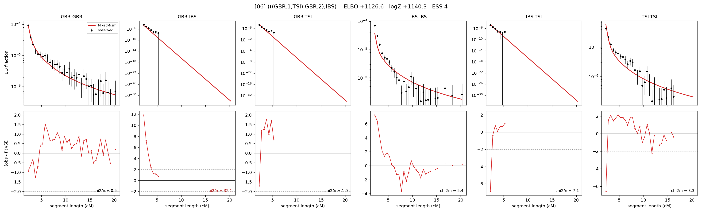

# `(((GBR.1,TSI),GBR.2),IBS)`

Model 06 of 21 | admixed leaf: **GBR** | 4 events, 8 nodes

## Model score

| quantity | value | |
|---|---|---|
| ELBO | +1126.61 | +- 0.20 (MC) |
| logZ (importance sampling) | +1140.35 | |
| ESS of the IS weights | 3.7 / 4000 | LOW -- treat logZ with suspicion |
| Stan dropped-constant correction | -25.77 | already applied |
| seed kept / runtime | 23 | 21 s |

## Events (in temporal order, most recent first)

| # | type | detail | time (gen) | cumulative |
|---|---|---|---|---|
| 1 | ADMIXTURE | GBR -> GBR.1 + GBR.2 | 150.2 +- 1.3 | 150.2 |
| 2 | MERGE | GBR.2 + TSI -> n1 | 14.8 +- 0.6 | 164.9 |
| 3 | MERGE | GBR.1 + n1 -> n2 | 9.8 +- 0.2 | 174.7 |
| 4 | MERGE | n2 + IBS -> root | 1.1 +- 0.0 | 175.8 |

## Admixture fraction

**f = 0.998 +- 0.000** (fraction from `GBR.1`; 0.002 from `GBR.2`)

Collapsed to a tree: one source carries <5% of the ancestry, so this graph is behaving as its no-admixture special case.

## Effective sizes (haploid)

| node | Ne | sd of log Ne |
|---|---|---|
| `GBR` | 225,286 | 0.07 |
| `IBS` | 718,655 | 0.14 |
| `TSI` | 607,862 | 0.14 |
| `GBR.1` | 7,125 | 0.03 |
| `GBR.2` | 2,689 | 0.06 |
| `n1` | 3,908 | 0.03 |
| `n2` | 8,592 | 0.03 |
| `root` | 7,059 | 0.03 |

log-Ne random-walk step scale tau = 1.493

## Fit quality by component

| component | log-likelihood | n terms | chi2/n |
|---|---|---|---|
| IBD | +1,208.3 | 113 | 5.00 |
| SNP | +34.8 | 6 | 7.38 |

chi2/n is the mean squared standardized residual: 1.0 = fits inside its own SEs. Do NOT compare the two log-likelihood LEVELS against each other -- different term counts and different units.

## SNP covariance residuals `(w_hat - W_pred)/w_se`

| | GBR | IBS | TSI |
|---|---|---|---|
| **GBR** | +1.35 | +2.32 | -2.93 |
| **IBS** | +2.32 | -3.59 | +1.52 |
| **TSI** | -2.93 | +1.52 | +2.10 |

