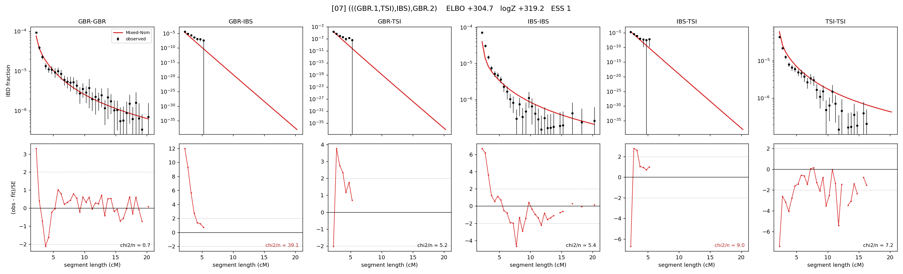

# `(((GBR.1,TSI),IBS),GBR.2)`

Model 07 of 21 | admixed leaf: **GBR** | 4 events, 8 nodes

## Model score

| quantity | value | |
|---|---|---|
| ELBO | +304.67 | +- 0.16 (MC) |
| logZ (importance sampling) | +319.15 | |
| ESS of the IS weights | 1.4 / 4000 | LOW -- treat logZ with suspicion |
| Stan dropped-constant correction | -25.77 | already applied |
| seed kept / runtime | 13 | 23 s |

## Events (in temporal order, most recent first)

| # | type | detail | time (gen) | cumulative |
|---|---|---|---|---|
| 1 | ADMIXTURE | GBR -> GBR.1 + GBR.2 | 1.2 +- 0.0 | 1.2 |
| 2 | MERGE | GBR.2 + TSI -> n1 | 202.3 +- 1.0 | 203.5 |
| 3 | MERGE | n1 + IBS -> n2 | 6.5 +- 0.3 | 210.0 |
| 4 | MERGE | GBR.1 + n2 -> root | 7.3 +- 0.2 | 217.3 |

## Admixture fraction

**f = 0.001 +- 0.000** (fraction from `GBR.1`; 0.999 from `GBR.2`)

Collapsed to a tree: one source carries <5% of the ancestry, so this graph is behaving as its no-admixture special case.

## Effective sizes (haploid)

| node | Ne | sd of log Ne |
|---|---|---|
| `GBR` | 196,434 | 0.09 |
| `IBS` | 594,461 | 0.11 |
| `TSI` | 285,049 | 0.05 |
| `GBR.1` | 0 | 0.05 |
| `GBR.2` | 195,301 | 0.09 |
| `n1` | 10,957 | 0.04 |
| `n2` | 7,640 | 0.04 |
| `root` | 1,797 | 0.02 |

log-Ne random-walk step scale tau = 2.147

## Fit quality by component

| component | log-likelihood | n terms | chi2/n |
|---|---|---|---|
| IBD | +1,091.8 | 113 | 6.76 |
| SNP | -630.8 | 6 | 229.27 |

chi2/n is the mean squared standardized residual: 1.0 = fits inside its own SEs. Do NOT compare the two log-likelihood LEVELS against each other -- different term counts and different units.

## SNP covariance residuals `(w_hat - W_pred)/w_se`

| | GBR | IBS | TSI |
|---|---|---|---|
| **GBR** | +8.12 | +14.79 | -18.14 |
| **IBS** | +14.79 | -3.01 | -13.82 |
| **TSI** | -18.14 | -13.82 | +23.54 |

