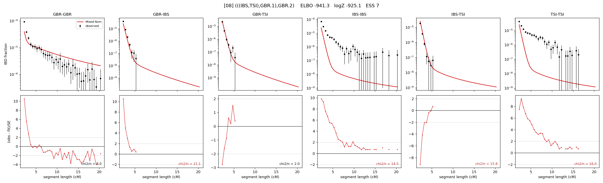

# `(((IBS,TSI),GBR.1),GBR.2)`

Model 08 of 21 | admixed leaf: **GBR** | 4 events, 8 nodes

> Graph where the two NON-admixed leaves merge first. Excluded by the 'first merge must involve an admixture branch' rule; included here because it is the standard local-clade + deep-source scenario.

## Model score

| quantity | value | |
|---|---|---|
| ELBO | -941.28 | +- 0.34 (MC) |
| logZ (importance sampling) | -925.09 | |
| ESS of the IS weights | 6.8 / 4000 | LOW -- treat logZ with suspicion |
| Stan dropped-constant correction | -25.77 | already applied |
| seed kept / runtime | 31 | 23 s |

## Events (in temporal order, most recent first)

| # | type | detail | time (gen) | cumulative |
|---|---|---|---|---|
| 1 | ADMIXTURE | GBR -> GBR.1 + GBR.2 | 1.0 +- 0.0 | 1.0 |
| 2 | MERGE | IBS + TSI -> n1 | 1.0 +- 0.0 | 2.0 |
| 3 | MERGE | GBR.2 + n1 -> n2 | 9.6 +- 3.1 | 11.6 |
| 4 | MERGE | GBR.1 + n2 -> root | 139.1 +- 3.6 | 150.8 |

## Admixture fraction

**f = 0.019 +- 0.000** (fraction from `GBR.1`; 0.981 from `GBR.2`)

Collapsed to a tree: one source carries <5% of the ancestry, so this graph is behaving as its no-admixture special case.

## Effective sizes (haploid)

| node | Ne | sd of log Ne |
|---|---|---|
| `GBR` | 83,236,795 | 0.25 |
| `IBS` | 107,275,946 | 0.26 |
| `TSI` | 107,643,480 | 0.26 |
| `GBR.1` | 13 | 0.05 |
| `GBR.2` | 112,354,559 | 0.25 |
| `n1` | 108,732,351 | 0.26 |
| `n2` | 112,513,296 | 0.25 |
| `root` | 15,105 | 0.02 |

log-Ne random-walk step scale tau = 2.084

## Fit quality by component

| component | log-likelihood | n terms | chi2/n |
|---|---|---|---|
| IBD | +789.5 | 113 | 12.64 |
| SNP | -1,546.6 | 6 | 534.52 |

chi2/n is the mean squared standardized residual: 1.0 = fits inside its own SEs. Do NOT compare the two log-likelihood LEVELS against each other -- different term counts and different units.

## SNP covariance residuals `(w_hat - W_pred)/w_se`

| | GBR | IBS | TSI |
|---|---|---|---|
| **GBR** | +8.10 | +13.01 | -17.13 |
| **IBS** | +13.01 | +17.56 | -36.03 |
| **TSI** | -17.13 | -36.03 | +32.64 |

