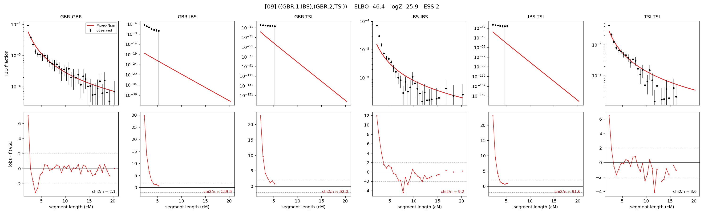

# `((GBR.1,IBS),(GBR.2,TSI))`

Model 09 of 21 | admixed leaf: **GBR** | 4 events, 8 nodes

## Model score

| quantity | value | |
|---|---|---|
| ELBO | -46.38 | +- 0.30 (MC) |
| logZ (importance sampling) | -25.93 | |
| ESS of the IS weights | 1.7 / 4000 | LOW -- treat logZ with suspicion |
| Stan dropped-constant correction | -25.77 | already applied |
| seed kept / runtime | 7 | 21 s |

## Events (in temporal order, most recent first)

| # | type | detail | time (gen) | cumulative |
|---|---|---|---|---|
| 1 | ADMIXTURE | GBR -> GBR.1 + GBR.2 | 137.9 +- 6.2 | 137.9 |
| 2 | MERGE | GBR.1 + IBS -> n1 | 15.3 +- 6.8 | 153.2 |
| 3 | MERGE | GBR.2 + TSI -> n2 | 879.9 +- 24.1 | 1,033.1 |
| 4 | MERGE | n1 + n2 -> root | 2.0 +- 0.0 | 1,035.1 |

## Admixture fraction

**f = 0.000 +- 0.000** (fraction from `GBR.1`; 1.000 from `GBR.2`)

Collapsed to a tree: one source carries <5% of the ancestry, so this graph is behaving as its no-admixture special case.

## Effective sizes (haploid)

| node | Ne | sd of log Ne |
|---|---|---|
| `GBR` | 172,056 | 0.07 |
| `IBS` | 641,780 | 0.18 |
| `TSI` | 361,907 | 0.06 |
| `GBR.1` | 35,824,413 | 0.18 |
| `GBR.2` | 267,275 | 0.05 |
| `n1` | 35,899,521 | 0.19 |
| `n2` | 87,599 | 0.19 |
| `root` | 77,986 | 0.36 |

log-Ne random-walk step scale tau = 1.002

## Fit quality by component

| component | log-likelihood | n terms | chi2/n |
|---|---|---|---|
| IBD | +51.2 | 113 | 25.29 |
| SNP | +39.5 | 6 | 5.81 |

chi2/n is the mean squared standardized residual: 1.0 = fits inside its own SEs. Do NOT compare the two log-likelihood LEVELS against each other -- different term counts and different units.

## SNP covariance residuals `(w_hat - W_pred)/w_se`

| | GBR | IBS | TSI |
|---|---|---|---|
| **GBR** | +0.73 | +1.68 | -1.83 |
| **IBS** | +1.68 | -2.73 | +1.24 |
| **TSI** | -1.83 | +1.24 | +1.18 |

