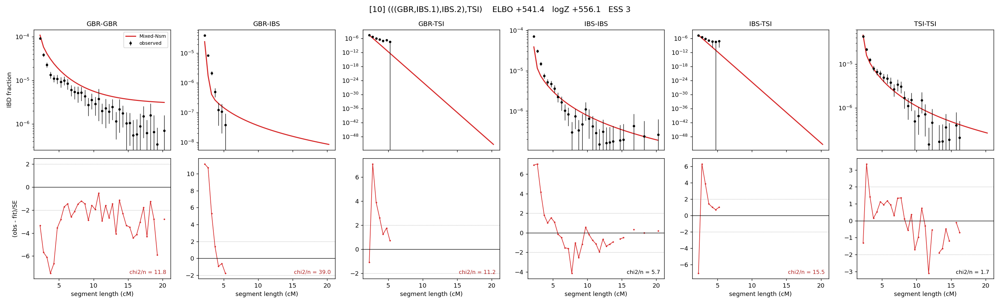

# `(((GBR,IBS.1),IBS.2),TSI)`

Model 10 of 21 | admixed leaf: **IBS** | 4 events, 8 nodes

## Model score

| quantity | value | |
|---|---|---|
| ELBO | +541.44 | +- 0.20 (MC) |
| logZ (importance sampling) | +556.09 | |
| ESS of the IS weights | 2.8 / 4000 | LOW -- treat logZ with suspicion |
| Stan dropped-constant correction | -25.77 | already applied |
| seed kept / runtime | 7 | 21 s |

## Events (in temporal order, most recent first)

| # | type | detail | time (gen) | cumulative |
|---|---|---|---|---|
| 1 | ADMIXTURE | IBS -> IBS.1 + IBS.2 | 1.0 +- 0.0 | 1.0 |
| 2 | MERGE | IBS.2 + GBR -> n1 | 1.0 +- 0.0 | 2.0 |
| 3 | MERGE | IBS.1 + n1 -> n2 | 294.6 +- 0.9 | 296.6 |
| 4 | MERGE | n2 + TSI -> root | 2.6 +- 0.0 | 299.2 |

## Admixture fraction

**f = 0.991 +- 0.001** (fraction from `IBS.1`; 0.009 from `IBS.2`)

Collapsed to a tree: one source carries <5% of the ancestry, so this graph is behaving as its no-admixture special case.

## Effective sizes (haploid)

| node | Ne | sd of log Ne |
|---|---|---|
| `GBR` | 2,861 | 0.07 |
| `IBS` | 647,658 | 0.08 |
| `TSI` | 461,696 | 0.10 |
| `IBS.1` | 640,308 | 0.08 |
| `IBS.2` | 118,490 | 0.05 |
| `n1` | 117,621 | 0.05 |
| `n2` | 1,237 | 0.05 |
| `root` | 62 | 0.02 |

log-Ne random-walk step scale tau = 3.093

## Fit quality by component

| component | log-likelihood | n terms | chi2/n |
|---|---|---|---|
| IBD | +908.4 | 113 | 9.82 |
| SNP | -82.6 | 6 | 46.53 |

chi2/n is the mean squared standardized residual: 1.0 = fits inside its own SEs. Do NOT compare the two log-likelihood LEVELS against each other -- different term counts and different units.

## SNP covariance residuals `(w_hat - W_pred)/w_se`

| | GBR | IBS | TSI |
|---|---|---|---|
| **GBR** | +9.48 | -6.15 | -8.11 |
| **IBS** | -6.15 | -0.30 | +7.58 |
| **TSI** | -8.11 | +7.58 | +4.29 |

