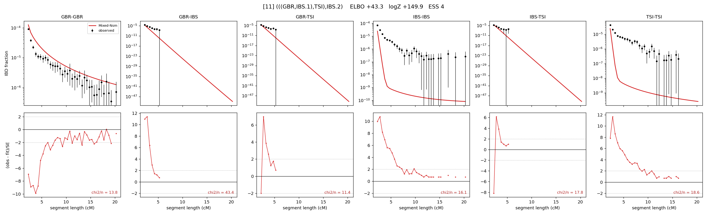

# `(((GBR,IBS.1),TSI),IBS.2)`

Model 11 of 21 | admixed leaf: **IBS** | 4 events, 8 nodes

## Model score

| quantity | value | |
|---|---|---|
| ELBO | +43.28 | +- 2.74 (MC) |
| logZ (importance sampling) | +149.89 | |
| ESS of the IS weights | 3.8 / 4000 | LOW -- treat logZ with suspicion |
| Stan dropped-constant correction | -25.77 | already applied |
| seed kept / runtime | 13 | 23 s |

## Events (in temporal order, most recent first)

| # | type | detail | time (gen) | cumulative |
|---|---|---|---|---|
| 1 | ADMIXTURE | IBS -> IBS.1 + IBS.2 | 1.0 +- 0.0 | 1.0 |
| 2 | MERGE | IBS.2 + GBR -> n1 | 292.1 +- 11.6 | 293.1 |
| 3 | MERGE | n1 + TSI -> n2 | 7.3 +- 4.1 | 300.4 |
| 4 | MERGE | IBS.1 + n2 -> root | 1.0 +- 0.0 | 301.4 |

## Admixture fraction

**f = 0.000 +- 0.000** (fraction from `IBS.1`; 1.000 from `IBS.2`)

Collapsed to a tree: one source carries <5% of the ancestry, so this graph is behaving as its no-admixture special case.

## Effective sizes (haploid)

| node | Ne | sd of log Ne |
|---|---|---|
| `GBR` | 98,404 | 0.10 |
| `IBS` | 45,923,809,724 | 2.09 |
| `TSI` | 74,161,001,805 | 3.15 |
| `IBS.1` | 0 | 0.55 |
| `IBS.2` | 55,112,118,264 | 2.14 |
| `n1` | 2,673 | 0.54 |
| `n2` | 51 | 0.47 |
| `root` | 59 | 0.40 |

log-Ne random-walk step scale tau = 1.929

## Fit quality by component

| component | log-likelihood | n terms | chi2/n |
|---|---|---|---|
| IBD | +510.6 | 113 | 17.71 |
| SNP | -190.7 | 6 | 82.57 |

chi2/n is the mean squared standardized residual: 1.0 = fits inside its own SEs. Do NOT compare the two log-likelihood LEVELS against each other -- different term counts and different units.

## SNP covariance residuals `(w_hat - W_pred)/w_se`

| | GBR | IBS | TSI |
|---|---|---|---|
| **GBR** | +11.13 | -7.42 | -9.40 |
| **IBS** | -7.42 | -0.32 | +9.09 |
| **TSI** | -9.40 | +9.09 | +4.83 |

