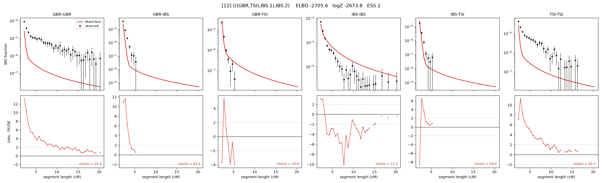

# `(((GBR,TSI),IBS.1),IBS.2)`

Model 12 of 21 | admixed leaf: **IBS** | 4 events, 8 nodes

> Graph where the two NON-admixed leaves merge first. Excluded by the 'first merge must involve an admixture branch' rule; included here because it is the standard local-clade + deep-source scenario.

## Model score

| quantity | value | |
|---|---|---|
| ELBO | -2705.59 | +- 0.61 (MC) |
| logZ (importance sampling) | -2673.84 | |
| ESS of the IS weights | 1.5 / 4000 | LOW -- treat logZ with suspicion |
| Stan dropped-constant correction | -25.77 | already applied |
| seed kept / runtime | 1 | 23 s |

## Events (in temporal order, most recent first)

| # | type | detail | time (gen) | cumulative |
|---|---|---|---|---|
| 1 | ADMIXTURE | IBS -> IBS.1 + IBS.2 | 1.0 +- 0.0 | 1.0 |
| 2 | MERGE | GBR + TSI -> n1 | 1.0 +- 0.0 | 2.0 |
| 3 | MERGE | IBS.2 + n1 -> n2 | 1.0 +- 0.0 | 3.0 |
| 4 | MERGE | IBS.1 + n2 -> root | 323.9 +- 0.6 | 326.9 |

## Admixture fraction

**f = 0.966 +- 0.004** (fraction from `IBS.1`; 0.034 from `IBS.2`)

Collapsed to a tree: one source carries <5% of the ancestry, so this graph is behaving as its no-admixture special case.

## Effective sizes (haploid)

| node | Ne | sd of log Ne |
|---|---|---|
| `GBR` | 9,843,284 | 0.33 |
| `IBS` | 372,204 | 0.18 |
| `TSI` | 11,704,458 | 0.39 |
| `IBS.1` | 293,343 | 0.15 |
| `IBS.2` | 9,125,612 | 0.30 |
| `n1` | 9,262,034 | 0.32 |
| `n2` | 7,741,038 | 0.27 |
| `root` | 4 | 0.29 |

log-Ne random-walk step scale tau = 1.742

## Fit quality by component

| component | log-likelihood | n terms | chi2/n |
|---|---|---|---|
| IBD | +465.9 | 113 | 17.64 |
| SNP | -2,982.9 | 6 | 1013.28 |

chi2/n is the mean squared standardized residual: 1.0 = fits inside its own SEs. Do NOT compare the two log-likelihood LEVELS against each other -- different term counts and different units.

## SNP covariance residuals `(w_hat - W_pred)/w_se`

| | GBR | IBS | TSI |
|---|---|---|---|
| **GBR** | +43.87 | -17.64 | -43.55 |
| **IBS** | -17.64 | +16.23 | +1.54 |
| **TSI** | -43.55 | +1.54 | +40.79 |

