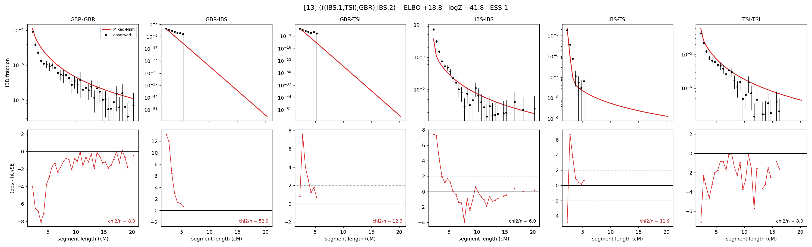

# `(((IBS.1,TSI),GBR),IBS.2)`

Model 13 of 21 | admixed leaf: **IBS** | 4 events, 8 nodes

## Model score

| quantity | value | |
|---|---|---|
| ELBO | +18.79 | +- 0.40 (MC) |
| logZ (importance sampling) | +41.83 | |
| ESS of the IS weights | 1.2 / 4000 | LOW -- treat logZ with suspicion |
| Stan dropped-constant correction | -25.77 | already applied |
| seed kept / runtime | 13 | 23 s |

## Events (in temporal order, most recent first)

| # | type | detail | time (gen) | cumulative |
|---|---|---|---|---|
| 1 | ADMIXTURE | IBS -> IBS.1 + IBS.2 | 1.0 +- 0.0 | 1.0 |
| 2 | MERGE | IBS.2 + TSI -> n1 | 1.0 +- 0.0 | 2.0 |
| 3 | MERGE | n1 + GBR -> n2 | 319.3 +- 0.9 | 321.3 |
| 4 | MERGE | IBS.1 + n2 -> root | 1.0 +- 0.0 | 322.3 |

## Admixture fraction

**f = 0.997 +- 0.000** (fraction from `IBS.1`; 0.003 from `IBS.2`)

Collapsed to a tree: one source carries <5% of the ancestry, so this graph is behaving as its no-admixture special case.

## Effective sizes (haploid)

| node | Ne | sd of log Ne |
|---|---|---|
| `GBR` | 110,533 | 0.05 |
| `IBS` | 1,141,621 | 0.22 |
| `TSI` | 626,190 | 0.04 |
| `IBS.1` | 696,621 | 0.22 |
| `IBS.2` | 357,536 | 0.03 |
| `n1` | 269,764 | 0.03 |
| `n2` | 1,727 | 0.07 |
| `root` | 14 | 0.09 |

log-Ne random-walk step scale tau = 3.919

## Fit quality by component

| component | log-likelihood | n terms | chi2/n |
|---|---|---|---|
| IBD | +849.8 | 113 | 10.98 |
| SNP | -494.7 | 6 | 183.89 |

chi2/n is the mean squared standardized residual: 1.0 = fits inside its own SEs. Do NOT compare the two log-likelihood LEVELS against each other -- different term counts and different units.

## SNP covariance residuals `(w_hat - W_pred)/w_se`

| | GBR | IBS | TSI |
|---|---|---|---|
| **GBR** | +14.30 | +5.30 | -20.37 |
| **IBS** | +5.30 | -3.36 | -2.26 |
| **TSI** | -20.37 | -2.26 | +20.43 |

