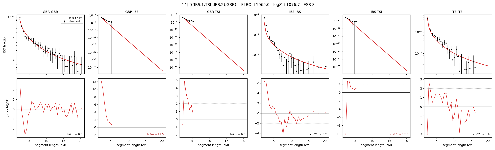

# `(((IBS.1,TSI),IBS.2),GBR)`

Model 14 of 21 | admixed leaf: **IBS** | 4 events, 8 nodes

## Model score

| quantity | value | |
|---|---|---|
| ELBO | +1065.02 | +- 0.16 (MC) |
| logZ (importance sampling) | +1076.73 | |
| ESS of the IS weights | 7.8 / 4000 | LOW -- treat logZ with suspicion |
| Stan dropped-constant correction | -25.77 | already applied |
| seed kept / runtime | 1 | 21 s |

## Events (in temporal order, most recent first)

| # | type | detail | time (gen) | cumulative |
|---|---|---|---|---|
| 1 | ADMIXTURE | IBS -> IBS.1 + IBS.2 | 1.0 +- 0.0 | 1.0 |
| 2 | MERGE | IBS.2 + TSI -> n1 | 220.1 +- 1.2 | 221.1 |
| 3 | MERGE | IBS.1 + n1 -> n2 | 3.7 +- 0.1 | 224.8 |
| 4 | MERGE | n2 + GBR -> root | 3.9 +- 0.1 | 228.7 |

## Admixture fraction

**f = 0.904 +- 0.008** (fraction from `IBS.1`; 0.096 from `IBS.2`)

## Effective sizes (haploid)

| node | Ne | sd of log Ne |
|---|---|---|
| `GBR` | 183,205 | 0.08 |
| `IBS` | 930,193 | 0.13 |
| `TSI` | 494,721 | 0.14 |
| `IBS.1` | 1,474,964 | 0.14 |
| `IBS.2` | 9,103 | 0.16 |
| `n1` | 1,321 | 0.04 |
| `n2` | 1,460 | 0.04 |
| `root` | 1,124 | 0.04 |

log-Ne random-walk step scale tau = 1.350

## Fit quality by component

| component | log-likelihood | n terms | chi2/n |
|---|---|---|---|
| IBD | +1,134.1 | 113 | 6.23 |
| SNP | +51.3 | 6 | 1.88 |

chi2/n is the mean squared standardized residual: 1.0 = fits inside its own SEs. Do NOT compare the two log-likelihood LEVELS against each other -- different term counts and different units.

## SNP covariance residuals `(w_hat - W_pred)/w_se`

| | GBR | IBS | TSI |
|---|---|---|---|
| **GBR** | +0.31 | -0.23 | -0.25 |
| **IBS** | -0.23 | +0.02 | +0.24 |
| **TSI** | -0.25 | +0.24 | +0.12 |

