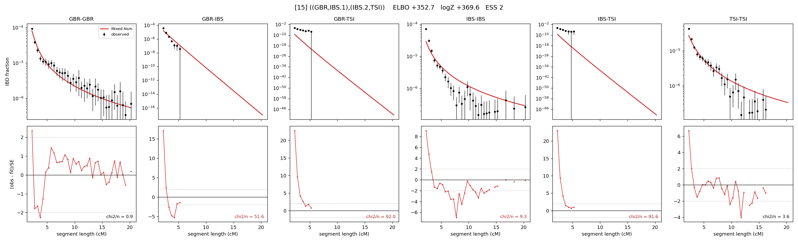

# `((GBR,IBS.1),(IBS.2,TSI))`

Model 15 of 21 | admixed leaf: **IBS** | 4 events, 8 nodes

## Model score

| quantity | value | |
|---|---|---|
| ELBO | +352.72 | +- 0.27 (MC) |
| logZ (importance sampling) | +369.60 | |
| ESS of the IS weights | 2.1 / 4000 | LOW -- treat logZ with suspicion |
| Stan dropped-constant correction | -25.77 | already applied |
| seed kept / runtime | 1 | 23 s |

## Events (in temporal order, most recent first)

| # | type | detail | time (gen) | cumulative |
|---|---|---|---|---|
| 1 | ADMIXTURE | IBS -> IBS.1 + IBS.2 | 1.0 +- 0.0 | 1.0 |
| 2 | MERGE | IBS.1 + GBR -> n1 | 76.4 +- 1.6 | 77.4 |
| 3 | MERGE | IBS.2 + TSI -> n2 | 387.4 +- 29.1 | 464.7 |
| 4 | MERGE | n1 + n2 -> root | 1.4 +- 0.1 | 466.1 |

## Admixture fraction

**f = 0.328 +- 0.005** (fraction from `IBS.1`; 0.672 from `IBS.2`)

## Effective sizes (haploid)

| node | Ne | sd of log Ne |
|---|---|---|
| `GBR` | 226,195 | 0.10 |
| `IBS` | 434,288 | 0.13 |
| `TSI` | 371,613 | 0.10 |
| `IBS.1` | 2,275,916 | 0.24 |
| `IBS.2` | 197,139 | 0.09 |
| `n1` | 65,619 | 0.08 |
| `n2` | 23,112 | 0.05 |
| `root` | 22,047 | 0.05 |

log-Ne random-walk step scale tau = 1.181

## Fit quality by component

| component | log-likelihood | n terms | chi2/n |
|---|---|---|---|
| IBD | +443.2 | 113 | 18.25 |
| SNP | +21.9 | 6 | 11.70 |

chi2/n is the mean squared standardized residual: 1.0 = fits inside its own SEs. Do NOT compare the two log-likelihood LEVELS against each other -- different term counts and different units.

## SNP covariance residuals `(w_hat - W_pred)/w_se`

| | GBR | IBS | TSI |
|---|---|---|---|
| **GBR** | -0.78 | -3.51 | +2.92 |
| **IBS** | -3.51 | +5.34 | -2.18 |
| **TSI** | +2.92 | -2.18 | -1.79 |

