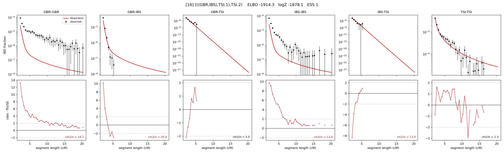

# `(((GBR,IBS),TSI.1),TSI.2)`

Model 16 of 21 | admixed leaf: **TSI** | 4 events, 8 nodes

> Graph where the two NON-admixed leaves merge first. Excluded by the 'first merge must involve an admixture branch' rule; included here because it is the standard local-clade + deep-source scenario.

## Model score

| quantity | value | |
|---|---|---|
| ELBO | -1914.29 | +- 0.60 (MC) |
| logZ (importance sampling) | -1878.07 | |
| ESS of the IS weights | 1.4 / 4000 | LOW -- treat logZ with suspicion |
| Stan dropped-constant correction | -25.77 | already applied |
| seed kept / runtime | 23 | 22 s |

## Events (in temporal order, most recent first)

| # | type | detail | time (gen) | cumulative |
|---|---|---|---|---|
| 1 | ADMIXTURE | TSI -> TSI.1 + TSI.2 | 1.0 +- 0.0 | 1.0 |
| 2 | MERGE | GBR + IBS -> n1 | 1.0 +- 0.0 | 2.0 |
| 3 | MERGE | TSI.2 + n1 -> n2 | 147.7 +- 2.2 | 149.7 |
| 4 | MERGE | TSI.1 + n2 -> root | 364.6 +- 2.9 | 514.3 |

## Admixture fraction

**f = 0.002 +- 0.000** (fraction from `TSI.1`; 0.998 from `TSI.2`)

Collapsed to a tree: one source carries <5% of the ancestry, so this graph is behaving as its no-admixture special case.

## Effective sizes (haploid)

| node | Ne | sd of log Ne |
|---|---|---|
| `GBR` | 10,196,759 | 0.39 |
| `IBS` | 9,455,966 | 0.39 |
| `TSI` | 464,069 | 0.11 |
| `TSI.1` | 0 | 0.11 |
| `TSI.2` | 487,523 | 0.11 |
| `n1` | 10,595,706 | 0.39 |
| `n2` | 16,024 | 0.07 |
| `root` | 12,376 | 0.04 |

log-Ne random-walk step scale tau = 1.503

## Fit quality by component

| component | log-likelihood | n terms | chi2/n |
|---|---|---|---|
| IBD | +857.4 | 113 | 10.92 |
| SNP | -2,600.8 | 6 | 885.92 |

chi2/n is the mean squared standardized residual: 1.0 = fits inside its own SEs. Do NOT compare the two log-likelihood LEVELS against each other -- different term counts and different units.

## SNP covariance residuals `(w_hat - W_pred)/w_se`

| | GBR | IBS | TSI |
|---|---|---|---|
| **GBR** | +39.71 | -43.36 | -24.12 |
| **IBS** | -43.36 | +23.78 | +22.84 |
| **TSI** | -24.12 | +22.84 | +12.63 |

