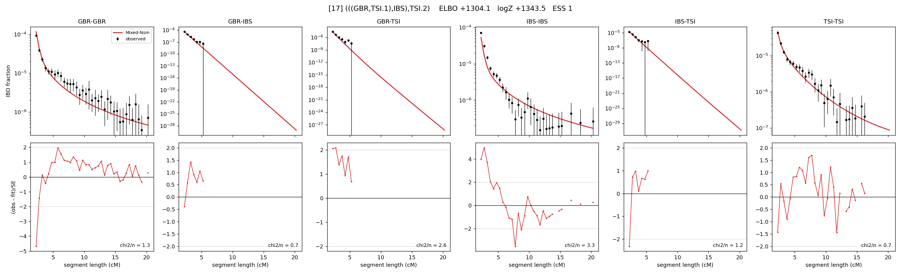

# `(((GBR,TSI.1),IBS),TSI.2)`

Model 17 of 21 | admixed leaf: **TSI** | 4 events, 8 nodes

## Model score

| quantity | value | |
|---|---|---|
| ELBO | +1304.11 | +- 0.58 (MC) |
| logZ (importance sampling) | +1343.54 | |
| ESS of the IS weights | 1.4 / 4000 | LOW -- treat logZ with suspicion |
| Stan dropped-constant correction | -25.77 | already applied |
| seed kept / runtime | 23 | 23 s |

## Events (in temporal order, most recent first)

| # | type | detail | time (gen) | cumulative |
|---|---|---|---|---|
| 1 | ADMIXTURE | TSI -> TSI.1 + TSI.2 | 15.8 +- 1.7 | 15.8 |
| 2 | MERGE | TSI.2 + GBR -> n1 | 133.6 +- 4.3 | 149.4 |
| 3 | MERGE | n1 + IBS -> n2 | 10.1 +- 3.0 | 159.5 |
| 4 | MERGE | TSI.1 + n2 -> root | 12.2 +- 4.2 | 171.7 |

## Admixture fraction

**f = 0.986 +- 0.009** (fraction from `TSI.1`; 0.014 from `TSI.2`)

Collapsed to a tree: one source carries <5% of the ancestry, so this graph is behaving as its no-admixture special case.

## Effective sizes (haploid)

| node | Ne | sd of log Ne |
|---|---|---|
| `GBR` | 274,027 | 0.18 |
| `IBS` | 757,041 | 0.20 |
| `TSI` | 1,828,318 | 0.32 |
| `TSI.1` | 363,494 | 0.09 |
| `TSI.2` | 5,070 | 0.43 |
| `n1` | 2,814 | 0.24 |
| `n2` | 4,701 | 0.26 |
| `root` | 9,781 | 0.12 |

log-Ne random-walk step scale tau = 1.569

## Fit quality by component

| component | log-likelihood | n terms | chi2/n |
|---|---|---|---|
| IBD | +1,382.8 | 113 | 2.03 |
| SNP | +34.1 | 6 | 7.63 |

chi2/n is the mean squared standardized residual: 1.0 = fits inside its own SEs. Do NOT compare the two log-likelihood LEVELS against each other -- different term counts and different units.

## SNP covariance residuals `(w_hat - W_pred)/w_se`

| | GBR | IBS | TSI |
|---|---|---|---|
| **GBR** | +1.00 | +1.02 | -1.78 |
| **IBS** | +1.02 | -2.22 | +1.43 |
| **TSI** | -1.78 | +1.43 | +1.05 |

