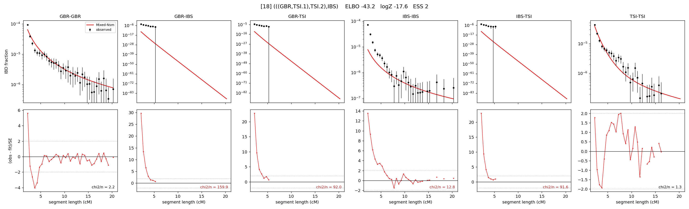

# `(((GBR,TSI.1),TSI.2),IBS)`

Model 18 of 21 | admixed leaf: **TSI** | 4 events, 8 nodes

## Model score

| quantity | value | |
|---|---|---|
| ELBO | -43.18 | +- 0.36 (MC) |
| logZ (importance sampling) | -17.56 | |
| ESS of the IS weights | 1.6 / 4000 | LOW -- treat logZ with suspicion |
| Stan dropped-constant correction | -25.77 | already applied |
| seed kept / runtime | 47 | 21 s |

## Events (in temporal order, most recent first)

| # | type | detail | time (gen) | cumulative |
|---|---|---|---|---|
| 1 | ADMIXTURE | TSI -> TSI.1 + TSI.2 | 36.8 +- 5.4 | 36.8 |
| 2 | MERGE | TSI.2 + GBR -> n1 | 578.5 +- 44.9 | 615.3 |
| 3 | MERGE | TSI.1 + n1 -> n2 | 9.1 +- 11.5 | 624.5 |
| 4 | MERGE | n2 + IBS -> root | 4.9 +- 2.3 | 629.4 |

## Admixture fraction

**f = 0.645 +- 0.010** (fraction from `TSI.1`; 0.355 from `TSI.2`)

## Effective sizes (haploid)

| node | Ne | sd of log Ne |
|---|---|---|
| `GBR` | 156,488 | 0.07 |
| `IBS` | 1,326,712 | 0.19 |
| `TSI` | 990,874 | 0.35 |
| `TSI.1` | 7,280,152 | 0.48 |
| `TSI.2` | 27,660 | 0.06 |
| `n1` | 470,309 | 0.10 |
| `n2` | 452,738 | 0.09 |
| `root` | 412,177 | 0.08 |

log-Ne random-walk step scale tau = 0.736

## Fit quality by component

| component | log-likelihood | n terms | chi2/n |
|---|---|---|---|
| IBD | +49.5 | 113 | 25.64 |
| SNP | +4.6 | 6 | 17.44 |

chi2/n is the mean squared standardized residual: 1.0 = fits inside its own SEs. Do NOT compare the two log-likelihood LEVELS against each other -- different term counts and different units.

## SNP covariance residuals `(w_hat - W_pred)/w_se`

| | GBR | IBS | TSI |
|---|---|---|---|
| **GBR** | +2.51 | +2.34 | -4.37 |
| **IBS** | +2.34 | -5.12 | +3.29 |
| **TSI** | -4.37 | +3.29 | +2.67 |

