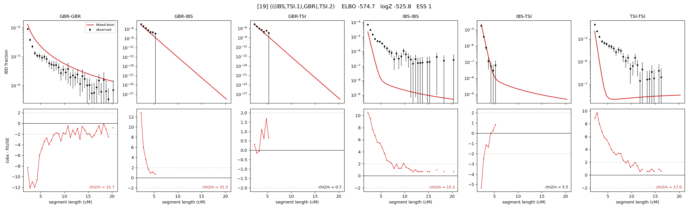

# `(((IBS,TSI.1),GBR),TSI.2)`

Model 19 of 21 | admixed leaf: **TSI** | 4 events, 8 nodes

## Model score

| quantity | value | |
|---|---|---|
| ELBO | -574.74 | +- 0.68 (MC) |
| logZ (importance sampling) | -525.80 | |
| ESS of the IS weights | 1.1 / 4000 | LOW -- treat logZ with suspicion |
| Stan dropped-constant correction | -25.77 | already applied |
| seed kept / runtime | 47 | 23 s |

## Events (in temporal order, most recent first)

| # | type | detail | time (gen) | cumulative |
|---|---|---|---|---|
| 1 | ADMIXTURE | TSI -> TSI.1 + TSI.2 | 1.0 +- 0.0 | 1.0 |
| 2 | MERGE | TSI.2 + IBS -> n1 | 1.1 +- 0.0 | 2.1 |
| 3 | MERGE | n1 + GBR -> n2 | 153.5 +- 5.4 | 155.5 |
| 4 | MERGE | TSI.1 + n2 -> root | 29.9 +- 3.6 | 185.5 |

## Admixture fraction

**f = 0.003 +- 0.000** (fraction from `TSI.1`; 0.997 from `TSI.2`)

Collapsed to a tree: one source carries <5% of the ancestry, so this graph is behaving as its no-admixture special case.

## Effective sizes (haploid)

| node | Ne | sd of log Ne |
|---|---|---|
| `GBR` | 87,192 | 0.09 |
| `IBS` | 1,233,122,850 | 0.95 |
| `TSI` | 658,317,601 | 0.89 |
| `TSI.1` | 0 | 0.24 |
| `TSI.2` | 521,451,625 | 0.86 |
| `n1` | 444,211,036 | 0.85 |
| `n2` | 12,740 | 0.31 |
| `root` | 21,704 | 0.02 |

log-Ne random-walk step scale tau = 1.008

## Fit quality by component

| component | log-likelihood | n terms | chi2/n |
|---|---|---|---|
| IBD | +524.1 | 113 | 17.42 |
| SNP | -848.7 | 6 | 301.89 |

chi2/n is the mean squared standardized residual: 1.0 = fits inside its own SEs. Do NOT compare the two log-likelihood LEVELS against each other -- different term counts and different units.

## SNP covariance residuals `(w_hat - W_pred)/w_se`

| | GBR | IBS | TSI |
|---|---|---|---|
| **GBR** | +23.00 | -25.48 | -13.76 |
| **IBS** | -25.48 | +14.56 | +12.72 |
| **TSI** | -13.76 | +12.72 | +7.35 |

