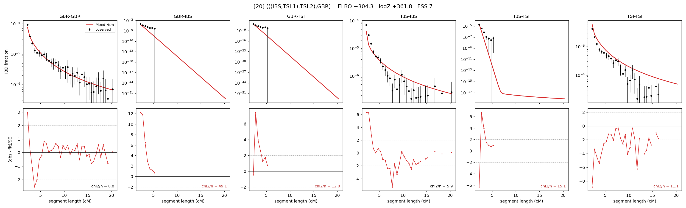

# `(((IBS,TSI.1),TSI.2),GBR)`

Model 20 of 21 | admixed leaf: **TSI** | 4 events, 8 nodes

## Model score

| quantity | value | |
|---|---|---|
| ELBO | +304.29 | +- 1.49 (MC) |
| logZ (importance sampling) | +361.81 | |
| ESS of the IS weights | 7.0 / 4000 | LOW -- treat logZ with suspicion |
| Stan dropped-constant correction | -25.77 | already applied |
| seed kept / runtime | 31 | 20 s |

## Events (in temporal order, most recent first)

| # | type | detail | time (gen) | cumulative |
|---|---|---|---|---|
| 1 | ADMIXTURE | TSI -> TSI.1 + TSI.2 | 1.0 +- 0.0 | 1.0 |
| 2 | MERGE | TSI.2 + IBS -> n1 | 1.0 +- 0.0 | 2.0 |
| 3 | MERGE | TSI.1 + n1 -> n2 | 313.3 +- 2.9 | 315.3 |
| 4 | MERGE | n2 + GBR -> root | 8.9 +- 1.0 | 324.2 |

## Admixture fraction

**f = 1.000 +- 0.000** (fraction from `TSI.1`; 0.000 from `TSI.2`)

Collapsed to a tree: one source carries <5% of the ancestry, so this graph is behaving as its no-admixture special case.

## Effective sizes (haploid)

| node | Ne | sd of log Ne |
|---|---|---|
| `GBR` | 188,227 | 0.16 |
| `IBS` | 657,210 | 0.19 |
| `TSI` | 247,575 | 0.09 |
| `TSI.1` | 253,602 | 0.09 |
| `TSI.2` | 561,452 | 0.19 |
| `n1` | 551,044 | 0.19 |
| `n2` | 4,158 | 0.21 |
| `root` | 10 | 0.21 |

log-Ne random-walk step scale tau = 2.526

## Fit quality by component

| component | log-likelihood | n terms | chi2/n |
|---|---|---|---|
| IBD | +923.0 | 113 | 9.66 |
| SNP | -375.9 | 6 | 144.28 |

chi2/n is the mean squared standardized residual: 1.0 = fits inside its own SEs. Do NOT compare the two log-likelihood LEVELS against each other -- different term counts and different units.

## SNP covariance residuals `(w_hat - W_pred)/w_se`

| | GBR | IBS | TSI |
|---|---|---|---|
| **GBR** | +5.45 | +10.93 | -12.73 |
| **IBS** | +10.93 | +0.29 | -13.18 |
| **TSI** | -12.73 | -13.18 | +18.10 |

