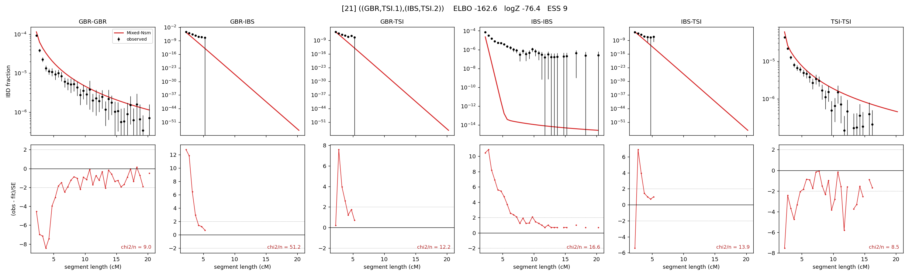

# `((GBR,TSI.1),(IBS,TSI.2))`

Model 21 of 21 | admixed leaf: **TSI** | 4 events, 8 nodes

## Model score

| quantity | value | |
|---|---|---|
| ELBO | -162.60 | +- 1.70 (MC) |
| logZ (importance sampling) | -76.38 | |
| ESS of the IS weights | 9.3 / 4000 | LOW -- treat logZ with suspicion |
| Stan dropped-constant correction | -25.77 | already applied |
| seed kept / runtime | 23 | 22 s |

## Events (in temporal order, most recent first)

| # | type | detail | time (gen) | cumulative |
|---|---|---|---|---|
| 1 | ADMIXTURE | TSI -> TSI.1 + TSI.2 | 1.0 +- 0.0 | 1.0 |
| 2 | MERGE | TSI.1 + GBR -> n1 | 313.0 +- 2.6 | 314.0 |
| 3 | MERGE | TSI.2 + IBS -> n2 | 1.2 +- 0.0 | 315.2 |
| 4 | MERGE | n1 + n2 -> root | 13.7 +- 0.3 | 328.9 |

## Admixture fraction

**f = 1.000 +- 0.000** (fraction from `TSI.1`; 0.000 from `TSI.2`)

Collapsed to a tree: one source carries <5% of the ancestry, so this graph is behaving as its no-admixture special case.

## Effective sizes (haploid)

| node | Ne | sd of log Ne |
|---|---|---|
| `GBR` | 110,014 | 0.15 |
| `IBS` | 75,170,929,363,750,558,041,393,594,368 | 11.90 |
| `TSI` | 289,349 | 0.15 |
| `TSI.1` | 271,888 | 0.13 |
| `TSI.2` | 173,235 | 0.44 |
| `n1` | 21,471 | 0.20 |
| `n2` | 54,963 | 0.35 |
| `root` | 5 | 0.19 |

log-Ne random-walk step scale tau = 3.096

## Fit quality by component

| component | log-likelihood | n terms | chi2/n |
|---|---|---|---|
| IBD | +655.9 | 113 | 14.61 |
| SNP | -530.1 | 6 | 195.70 |

chi2/n is the mean squared standardized residual: 1.0 = fits inside its own SEs. Do NOT compare the two log-likelihood LEVELS against each other -- different term counts and different units.

## SNP covariance residuals `(w_hat - W_pred)/w_se`

| | GBR | IBS | TSI |
|---|---|---|---|
| **GBR** | +14.40 | +4.87 | -20.25 |
| **IBS** | +4.87 | -2.27 | -3.04 |
| **TSI** | -20.25 | -3.04 | +20.66 |

