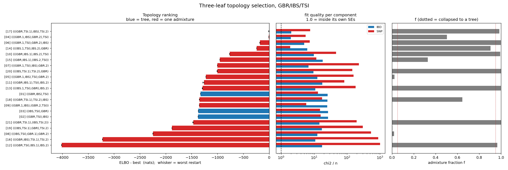

# Topology selection on GBR / IBS / TSI

21 models (3 trees + 18 one-admixture graphs), `mixed_model_Nsmooth`, Pathfinder with 6+ seeds, best ELBO kept.

## Ranking

| rank | topology | adm | ELBO | dELBO | restart range | ESS | chi2/n IBD | chi2/n SNP | f | P_model | P_argmax |
|---|---|---|---|---|---|---|---|---|---|---|---|
| 1 | [`(((GBR,TSI.1),IBS),TSI.2)`](../17_(((GBR,TSI.1),IBS),TSI.2)/report.md) | 1 | +1304.1 | +0.0 | 11.6 | 1.4 | 2.03 | 7.63 | 0.986 | 0.999 | 1.000 |
| 2 | [`(((GBR.1,IBS),GBR.2),TSI)`](../04_(((GBR.1,IBS),GBR.2),TSI)/report.md) | 1 | +1297.6 | -6.5 | 1.6 | 1.1 | 1.99 | 5.55 | 0.503 | 0.001 | 0.000 |
| 3 | [`(((GBR.1,TSI),GBR.2),IBS)`](../06_(((GBR.1,TSI),GBR.2),IBS)/report.md) | 1 | +1126.6 | -177.5 | 3.6 | 3.7 | 5.00 | 7.38 | 0.998 | 0.000 | 0.000 |
| 4 | [`(((IBS.1,TSI),IBS.2),GBR)`](../14_(((IBS.1,TSI),IBS.2),GBR)/report.md) | 1 | +1065.0 | -239.1 | 0.9 | 7.8 | 6.23 | 1.88 | 0.904 | 0.000 | 0.000 |
| 5 | [`(((GBR,IBS.1),IBS.2),TSI)`](../10_(((GBR,IBS.1),IBS.2),TSI)/report.md) | 1 | +541.4 | -762.7 | 2.5 | 2.8 | 9.82 | 46.53 | 0.991 | 0.000 | 0.000 |
| 6 | [`((GBR,IBS.1),(IBS.2,TSI))`](../15_((GBR,IBS.1),(IBS.2,TSI))/report.md) | 1 | +352.7 | -951.4 | 1.7 | 2.1 | 18.25 | 11.70 | 0.328 | 0.000 | 0.000 |
| 7 | [`(((GBR.1,TSI),IBS),GBR.2)`](../07_(((GBR.1,TSI),IBS),GBR.2)/report.md) | 1 | +304.7 | -999.4 | 1.6 | 1.4 | 6.76 | 229.27 | 0.001 | 0.000 | 0.000 |
| 8 | [`(((IBS,TSI.1),TSI.2),GBR)`](../20_(((IBS,TSI.1),TSI.2),GBR)/report.md) | 1 | +304.3 | -999.8 | 7.8 | 7.0 | 9.66 | 144.28 | 1.000 | 0.000 | 0.000 |
| 9 | [`(((GBR.1,IBS),TSI),GBR.2)`](../05_(((GBR.1,IBS),TSI),GBR.2)/report.md) | 1 | +82.9 | -1221.2 | 3.6 | 8.3 | 12.54 | 157.86 | 0.022 | 0.000 | 0.000 |
| 10 | [`(((GBR,IBS.1),TSI),IBS.2)`](../11_(((GBR,IBS.1),TSI),IBS.2)/report.md) | 1 | +43.3 | -1260.8 | 20.4 | 3.8 | 17.71 | 82.57 | 0.000 | 0.000 | 0.000 |
| 11 | [`(((IBS.1,TSI),GBR),IBS.2)`](../13_(((IBS.1,TSI),GBR),IBS.2)/report.md) | 1 | +18.8 | -1285.3 | 10.8 | 1.2 | 10.98 | 183.89 | 0.997 | 0.000 | 0.000 |
| 12 | [`((GBR,IBS),TSI)`](../01_((GBR,IBS),TSI)/report.md) | 0 | -22.2 | -1326.3 | 1.5 | 3.8 | 26.06 | 13.14 | - | 0.000 | 0.000 |
| 13 | [`(((GBR,TSI.1),TSI.2),IBS)`](../18_(((GBR,TSI.1),TSI.2),IBS)/report.md) | 1 | -43.2 | -1347.3 | 2.5 | 1.6 | 25.64 | 17.44 | 0.645 | 0.000 | 0.000 |
| 14 | [`((GBR.1,IBS),(GBR.2,TSI))`](../09_((GBR.1,IBS),(GBR.2,TSI))/report.md) | 1 | -46.4 | -1350.5 | 1.8 | 1.7 | 25.29 | 5.81 | 0.000 | 0.000 | 0.000 |
| 15 | [`((IBS,TSI),GBR)`](../03_((IBS,TSI),GBR)/report.md) | 0 | -65.8 | -1369.9 | 2.3 | 7.1 | 26.61 | 15.18 | - | 0.000 | 0.000 |
| 16 | [`((GBR,TSI),IBS)`](../02_((GBR,TSI),IBS)/report.md) | 0 | -68.6 | -1372.7 | 1.6 | 2.5 | 26.64 | 15.87 | - | 0.000 | 0.000 |
| 17 | [`((GBR,TSI.1),(IBS,TSI.2))`](../21_((GBR,TSI.1),(IBS,TSI.2))/report.md) | 1 | -162.6 | -1466.7 | 11.5 | 9.3 | 14.61 | 195.70 | 1.000 | 0.000 | 0.000 |
| 18 | [`(((IBS,TSI.1),GBR),TSI.2)`](../19_(((IBS,TSI.1),GBR),TSI.2)/report.md) | 1 | -574.7 | -1878.8 | 1.4 | 1.1 | 17.42 | 301.89 | 0.003 | 0.000 | 0.000 |
| 19 | [`(((IBS,TSI),GBR.1),GBR.2)`](../08_(((IBS,TSI),GBR.1),GBR.2)/report.md) | 1 | -941.3 | -2245.4 | 2.3 | 6.8 | 12.64 | 534.52 | 0.019 | 0.000 | 0.000 |
| 20 | [`(((GBR,IBS),TSI.1),TSI.2)`](../16_(((GBR,IBS),TSI.1),TSI.2)/report.md) | 1 | -1914.3 | -3218.4 | 5.4 | 1.4 | 10.92 | 885.92 | 0.002 | 0.000 | 0.000 |
| 21 | [`(((GBR,TSI),IBS.1),IBS.2)`](../12_(((GBR,TSI),IBS.1),IBS.2)/report.md) | 1 | -2705.6 | -4009.7 | 4.5 | 1.5 | 17.64 | 1013.28 | 0.966 | 0.000 | 0.000 |

## Selection

- **Best model: `(((GBR,TSI.1),IBS),TSI.2)`**, ELBO +1304.1, P_model = 0.999, P_argmax = 1.000.
- Runner-up `(((GBR.1,IBS),GBR.2),TSI)` is -6.5 nats behind. The winner's 6 restarts span 11.6 nats, and **5 of them beat the runner-up's best restart** -- so 1 in 6 single-restart runs would have ranked the two the other way. Treat the top two as close.
- Best tree `((GBR,IBS),TSI)` vs best admixture graph `(((GBR,TSI.1),IBS),TSI.2)`: +1326.3 nats for 3 extra Ne, 2 extra times and 1 fraction.

## How to read the two probabilities

`P_model` is softmax over the 21 ELBOs with a uniform model prior -- the posterior model probability. `P_argmax` bootstraps the Pathfinder draws and counts how often each model wins, so it measures only whether the RANKING is stable against Monte Carlo error. Both saturate at 1.000/0.000 whenever the gaps exceed a few nats, which they do here; the informative number is dELBO.

## Caveats that travel with these numbers

1. The ELBO is a lower bound on log Z and the gap KL(q||p) differs per model, so a model whose posterior happens to be more Gaussian is rewarded for that alone. The importance-sampling `logZ` would correct it, but the ESS column shows the weights are degenerate (max ESS 9 of 4000), so `logZ` cannot be trusted here either.
2. An admixture graph splits the admixed leaf into two source branches with separate Ne -- it buys a piecewise Ne, which these data independently want. A win by an admixture graph is evidence for non-constant Ne at least as much as for admixture, and three leaves cannot separate the two. Check each folder's residual row for a monotone tilt before reading any result as admixture.
3. These probabilities are conditional on the 21 listed models being the whole hypothesis space. Two admixture events, and non-constant Ne without admixture, are not in it.
