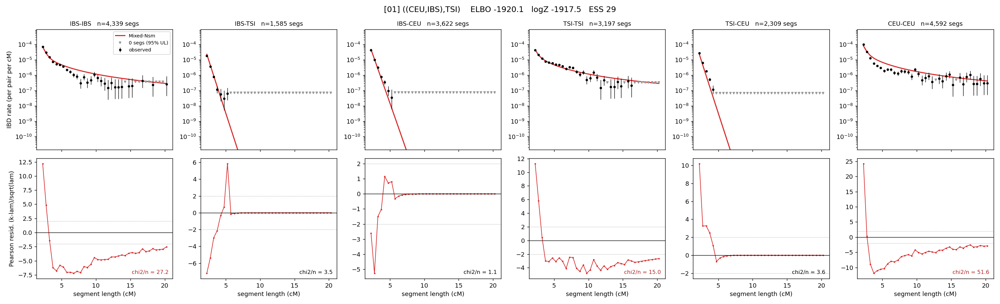

# `((CEU,IBS),TSI)`

Model 01 of 21 | tree (no admixture) | 2 events, 5 nodes

## Model score

| quantity | value | |
|---|---|---|
| ELBO | -1920.09 | +- 0.05 (MC) |
| logZ (importance sampling) | -1917.46 | |
| ESS of the IS weights | 28.9 / 4000 | LOW -- treat logZ with suspicion |
| Stan dropped-constant correction | -13.81 | already applied |
| seed kept / runtime | 31 | 10 s |

## Events (in temporal order, most recent first)

| # | type | detail | time (gen) | cumulative |
|---|---|---|---|---|
| 1 | MERGE | IBS + CEU -> n1 | 150.9 +- 1.0 | 150.9 |
| 2 | MERGE | n1 + TSI -> root | 6.9 +- 0.4 | 157.8 |

## Effective sizes (haploid)

| node | Ne | sd of log Ne |
|---|---|---|
| `IBS` | 426,815 | 0.03 |
| `TSI` | 424,588 | 0.03 |
| `CEU` | 292,338 | 0.03 |
| `n1` | 3,088 | 0.07 |
| `root` | 13,024 | 0.04 |

log-Ne random-walk step scale tau = 1.587

## Fit quality by component

| component | log-likelihood | n terms | chi2/n |
|---|---|---|---|
| IBD | -822.4 | 222 | 4.95 |
| SNP | -1,022.2 | 6 | 359.47 |

chi2/n is the mean squared standardized residual: 1.0 = fits inside its own SEs. Do NOT compare the two log-likelihood LEVELS against each other -- different term counts and different units.

## SNP covariance residuals `(w_hat - W_pred)/w_se`

| | IBS | TSI | CEU |
|---|---|---|---|
| **IBS** | +15.35 | +16.72 | -25.50 |
| **TSI** | +16.72 | +8.65 | -16.03 |
| **CEU** | -25.50 | -16.03 | +25.67 |

