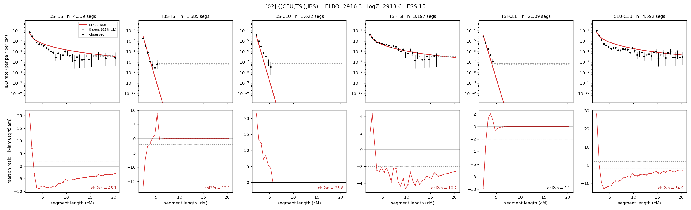

# `((CEU,TSI),IBS)`

Model 02 of 21 | tree (no admixture) | 2 events, 5 nodes

## Model score

| quantity | value | |
|---|---|---|
| ELBO | -2916.30 | +- 0.03 (MC) |
| logZ (importance sampling) | -2913.61 | |
| ESS of the IS weights | 15.4 / 4000 | LOW -- treat logZ with suspicion |
| Stan dropped-constant correction | -13.81 | already applied |
| seed kept / runtime | 1 | 12 s |

## Events (in temporal order, most recent first)

| # | type | detail | time (gen) | cumulative |
|---|---|---|---|---|
| 1 | MERGE | TSI + CEU -> n1 | 172.3 +- 1.7 | 172.3 |
| 2 | MERGE | IBS + n1 -> root | 3.1 +- 0.2 | 175.4 |

## Effective sizes (haploid)

| node | Ne | sd of log Ne |
|---|---|---|
| `IBS` | 339,417 | 0.02 |
| `TSI` | 443,798 | 0.03 |
| `CEU` | 255,543 | 0.03 |
| `n1` | 2,979 | 0.06 |
| `root` | 5,462 | 0.06 |

log-Ne random-walk step scale tau = 1.427

## Fit quality by component

| component | log-likelihood | n terms | chi2/n |
|---|---|---|---|
| IBD | -1,732.6 | 222 | 14.90 |
| SNP | -1,109.8 | 6 | 388.68 |

chi2/n is the mean squared standardized residual: 1.0 = fits inside its own SEs. Do NOT compare the two log-likelihood LEVELS against each other -- different term counts and different units.

## SNP covariance residuals `(w_hat - W_pred)/w_se`

| | IBS | TSI | CEU |
|---|---|---|---|
| **IBS** | +3.14 | +4.08 | -5.68 |
| **TSI** | +4.08 | +26.85 | -29.17 |
| **CEU** | -5.68 | -29.17 | +26.46 |

