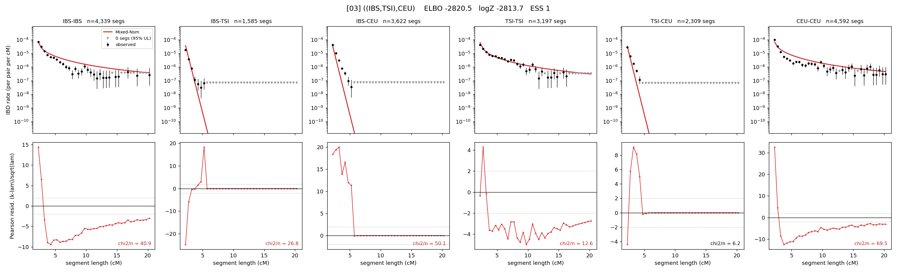

# `((IBS,TSI),CEU)`

Model 03 of 21 | tree (no admixture) | 2 events, 5 nodes

## Model score

| quantity | value | |
|---|---|---|
| ELBO | -2820.51 | +- 0.14 (MC) |
| logZ (importance sampling) | -2813.74 | |
| ESS of the IS weights | 1.1 / 4000 | LOW -- treat logZ with suspicion |
| Stan dropped-constant correction | -13.81 | already applied |
| seed kept / runtime | 13 | 10 s |

## Events (in temporal order, most recent first)

| # | type | detail | time (gen) | cumulative |
|---|---|---|---|---|
| 1 | MERGE | IBS + TSI -> n1 | 204.1 +- 1.6 | 204.1 |
| 2 | MERGE | n1 + CEU -> root | 2.3 +- 0.2 | 206.5 |

## Effective sizes (haploid)

| node | Ne | sd of log Ne |
|---|---|---|
| `IBS` | 326,794 | 0.04 |
| `TSI` | 399,743 | 0.03 |
| `CEU` | 266,002 | 0.03 |
| `n1` | 1,060 | 0.08 |
| `root` | 1,767 | 0.06 |

log-Ne random-walk step scale tau = 1.453

## Fit quality by component

| component | log-likelihood | n terms | chi2/n |
|---|---|---|---|
| IBD | -2,166.5 | 222 | 27.82 |
| SNP | -570.7 | 6 | 208.96 |

chi2/n is the mean squared standardized residual: 1.0 = fits inside its own SEs. Do NOT compare the two log-likelihood LEVELS against each other -- different term counts and different units.

## SNP covariance residuals `(w_hat - W_pred)/w_se`

| | IBS | TSI | CEU |
|---|---|---|---|
| **IBS** | +8.85 | -18.38 | +4.95 |
| **TSI** | -18.38 | +22.33 | -14.88 |
| **CEU** | +4.95 | -14.88 | +9.59 |

