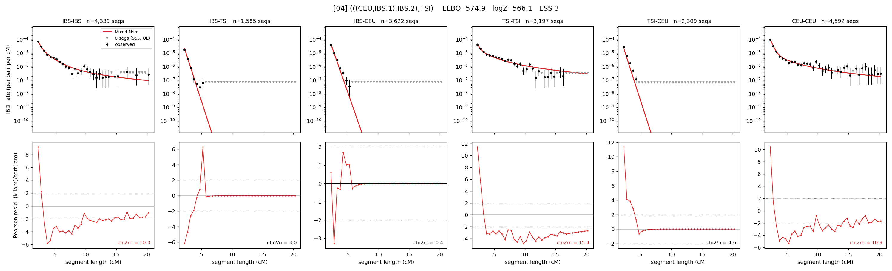

# `(((CEU,IBS.1),IBS.2),TSI)`

Model 04 of 21 | admixed leaf: **IBS** | 4 events, 8 nodes

## Model score

| quantity | value | |
|---|---|---|
| ELBO | -574.93 | +- 0.12 (MC) |
| logZ (importance sampling) | -566.11 | |
| ESS of the IS weights | 3.3 / 4000 | LOW -- treat logZ with suspicion |
| Stan dropped-constant correction | -25.77 | already applied |
| seed kept / runtime | 47 | 22 s |

## Events (in temporal order, most recent first)

| # | type | detail | time (gen) | cumulative |
|---|---|---|---|---|
| 1 | ADMIXTURE | IBS -> IBS.1 + IBS.2 | 36.0 +- 0.9 | 36.0 |
| 2 | MERGE | IBS.2 + CEU -> n1 | 109.6 +- 0.6 | 145.6 |
| 3 | MERGE | IBS.1 + n1 -> n2 | 7.5 +- 0.1 | 153.1 |
| 4 | MERGE | n2 + TSI -> root | 6.6 +- 0.1 | 159.8 |

## Admixture fraction

**f = 0.983 +- 0.000** (fraction from `IBS.1`; 0.017 from `IBS.2`)

Collapsed to a tree: one source carries <5% of the ancestry, so this graph is behaving as its no-admixture special case.

## Effective sizes (haploid)

| node | Ne | sd of log Ne |
|---|---|---|
| `IBS` | 1,325,304 | 0.15 |
| `TSI` | 418,495 | 0.03 |
| `CEU` | 660,129 | 0.06 |
| `IBS.1` | 259,776 | 0.07 |
| `IBS.2` | 2,457 | 0.05 |
| `n1` | 2,170 | 0.03 |
| `n2` | 3,130 | 0.02 |
| `root` | 12,552 | 0.01 |

log-Ne random-walk step scale tau = 1.666

## Fit quality by component

| component | log-likelihood | n terms | chi2/n |
|---|---|---|---|
| IBD | -504.2 | 222 | 2.87 |
| SNP | +50.4 | 6 | 1.93 |

chi2/n is the mean squared standardized residual: 1.0 = fits inside its own SEs. Do NOT compare the two log-likelihood LEVELS against each other -- different term counts and different units.

## SNP covariance residuals `(w_hat - W_pred)/w_se`

| | IBS | TSI | CEU |
|---|---|---|---|
| **IBS** | +0.57 | -1.01 | +0.20 |
| **TSI** | -1.01 | +1.60 | -1.20 |
| **CEU** | +0.20 | -1.20 | +0.87 |

