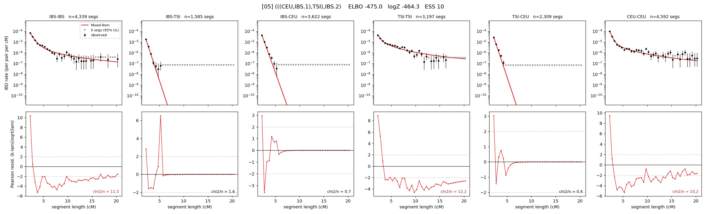

# `(((CEU,IBS.1),TSI),IBS.2)`

Model 05 of 21 | admixed leaf: **IBS** | 4 events, 8 nodes

## Model score

| quantity | value | |
|---|---|---|
| ELBO | -474.99 | +- 0.14 (MC) |
| logZ (importance sampling) | -464.32 | |
| ESS of the IS weights | 9.6 / 4000 | LOW -- treat logZ with suspicion |
| Stan dropped-constant correction | -25.77 | already applied |
| seed kept / runtime | 23 | 23 s |

## Events (in temporal order, most recent first)

| # | type | detail | time (gen) | cumulative |
|---|---|---|---|---|
| 1 | ADMIXTURE | IBS -> IBS.1 + IBS.2 | 70.6 +- 0.4 | 70.6 |
| 2 | MERGE | IBS.2 + CEU -> n1 | 77.8 +- 0.7 | 148.4 |
| 3 | MERGE | n1 + TSI -> n2 | 11.4 +- 0.4 | 159.7 |
| 4 | MERGE | IBS.1 + n2 -> root | 8.8 +- 0.1 | 168.5 |

## Admixture fraction

**f = 0.595 +- 0.004** (fraction from `IBS.1`; 0.405 from `IBS.2`)

## Effective sizes (haploid)

| node | Ne | sd of log Ne |
|---|---|---|
| `IBS` | 871,072 | 0.06 |
| `TSI` | 451,595 | 0.03 |
| `CEU` | 671,056 | 0.10 |
| `IBS.1` | 133,879 | 0.03 |
| `IBS.2` | 17,803 | 0.05 |
| `n1` | 2,003 | 0.05 |
| `n2` | 4,366 | 0.05 |
| `root` | 19,355 | 0.01 |

log-Ne random-walk step scale tau = 1.627

## Fit quality by component

| component | log-likelihood | n terms | chi2/n |
|---|---|---|---|
| IBD | -407.1 | 222 | 1.88 |
| SNP | +53.2 | 6 | 1.01 |

chi2/n is the mean squared standardized residual: 1.0 = fits inside its own SEs. Do NOT compare the two log-likelihood LEVELS against each other -- different term counts and different units.

## SNP covariance residuals `(w_hat - W_pred)/w_se`

| | IBS | TSI | CEU |
|---|---|---|---|
| **IBS** | +0.56 | +0.01 | -0.51 |
| **TSI** | +0.01 | +0.75 | -0.78 |
| **CEU** | -0.51 | -0.78 | +0.88 |

