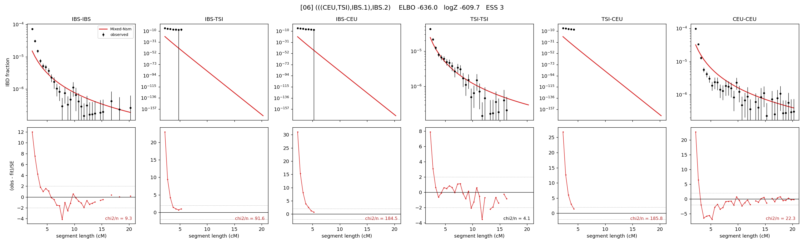

# `(((CEU,TSI),IBS.1),IBS.2)`

Model 06 of 21 | admixed leaf: **IBS** | 4 events, 8 nodes

> Graph where the two NON-admixed leaves merge first. Excluded by the 'first merge must involve an admixture branch' rule; included here because it is the standard local-clade + deep-source scenario.

## Model score

| quantity | value | |
|---|---|---|
| ELBO | -635.99 | +- 0.44 (MC) |
| logZ (importance sampling) | -609.68 | |
| ESS of the IS weights | 3.3 / 4000 | LOW -- treat logZ with suspicion |
| Stan dropped-constant correction | -25.77 | already applied |
| seed kept / runtime | 13 | 24 s |

## Events (in temporal order, most recent first)

| # | type | detail | time (gen) | cumulative |
|---|---|---|---|---|
| 1 | ADMIXTURE | IBS -> IBS.1 + IBS.2 | 209.3 +- 68.5 | 209.3 |
| 2 | MERGE | TSI + CEU -> n1 | 893.9 +- 76.3 | 1,103.2 |
| 3 | MERGE | IBS.2 + n1 -> n2 | 2.2 +- 0.1 | 1,105.4 |
| 4 | MERGE | IBS.1 + n2 -> root | 113.7 +- 4.2 | 1,219.1 |

## Admixture fraction

**f = 0.009 +- 0.001** (fraction from `IBS.1`; 0.991 from `IBS.2`)

Collapsed to a tree: one source carries <5% of the ancestry, so this graph is behaving as its no-admixture special case.

## Effective sizes (haploid)

| node | Ne | sd of log Ne |
|---|---|---|
| `IBS` | 659,563 | 0.13 |
| `TSI` | 411,746 | 0.06 |
| `CEU` | 312,652 | 0.07 |
| `IBS.1` | 5,706,282 | 0.31 |
| `IBS.2` | 4,339,186 | 0.28 |
| `n1` | 97,766 | 0.03 |
| `n2` | 87,005 | 0.03 |
| `root` | 12,885 | 0.04 |

log-Ne random-walk step scale tau = 1.512

## Fit quality by component

| component | log-likelihood | n terms | chi2/n |
|---|---|---|---|
| IBD | -556.1 | 110 | 36.65 |
| SNP | +34.7 | 6 | 7.17 |

chi2/n is the mean squared standardized residual: 1.0 = fits inside its own SEs. Do NOT compare the two log-likelihood LEVELS against each other -- different term counts and different units.

## SNP covariance residuals `(w_hat - W_pred)/w_se`

| | IBS | TSI | CEU |
|---|---|---|---|
| **IBS** | -2.33 | +2.72 | +0.19 |
| **TSI** | +2.72 | +0.15 | -1.33 |
| **CEU** | +0.19 | -1.33 | +0.98 |

