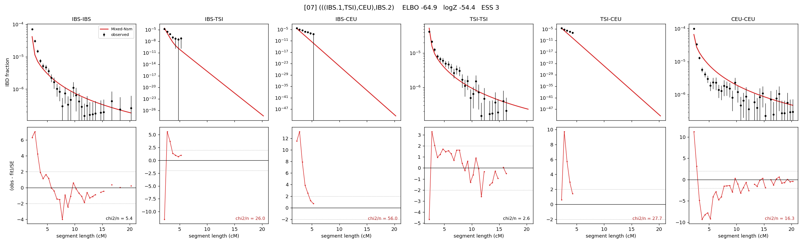

# `(((IBS.1,TSI),CEU),IBS.2)`

Model 07 of 21 | admixed leaf: **IBS** | 4 events, 8 nodes

## Model score

| quantity | value | |
|---|---|---|
| ELBO | -64.90 | +- 0.15 (MC) |
| logZ (importance sampling) | -54.37 | |
| ESS of the IS weights | 2.6 / 4000 | LOW -- treat logZ with suspicion |
| Stan dropped-constant correction | -25.77 | already applied |
| seed kept / runtime | 7 | 23 s |

## Events (in temporal order, most recent first)

| # | type | detail | time (gen) | cumulative |
|---|---|---|---|---|
| 1 | ADMIXTURE | IBS -> IBS.1 + IBS.2 | 1.0 +- 0.0 | 1.0 |
| 2 | MERGE | IBS.2 + TSI -> n1 | 129.7 +- 1.2 | 130.7 |
| 3 | MERGE | n1 + CEU -> n2 | 161.5 +- 1.0 | 292.2 |
| 4 | MERGE | IBS.1 + n2 -> root | 2.4 +- 0.0 | 294.5 |

## Admixture fraction

**f = 0.985 +- 0.000** (fraction from `IBS.1`; 0.015 from `IBS.2`)

Collapsed to a tree: one source carries <5% of the ancestry, so this graph is behaving as its no-admixture special case.

## Effective sizes (haploid)

| node | Ne | sd of log Ne |
|---|---|---|
| `IBS` | 630,608 | 0.07 |
| `TSI` | 541,065 | 0.15 |
| `CEU` | 255,643 | 0.04 |
| `IBS.1` | 648,093 | 0.07 |
| `IBS.2` | 76,558 | 0.03 |
| `n1` | 83,882 | 0.03 |
| `n2` | 3,459 | 0.03 |
| `root` | 65 | 0.04 |

log-Ne random-walk step scale tau = 2.782

## Fit quality by component

| component | log-likelihood | n terms | chi2/n |
|---|---|---|---|
| IBD | +700.2 | 110 | 13.86 |
| SNP | -541.1 | 6 | 199.10 |

chi2/n is the mean squared standardized residual: 1.0 = fits inside its own SEs. Do NOT compare the two log-likelihood LEVELS against each other -- different term counts and different units.

## SNP covariance residuals `(w_hat - W_pred)/w_se`

| | IBS | TSI | CEU |
|---|---|---|---|
| **IBS** | +1.64 | +15.79 | -12.55 |
| **TSI** | +15.79 | +9.89 | -16.90 |
| **CEU** | -12.55 | -16.90 | +19.94 |

