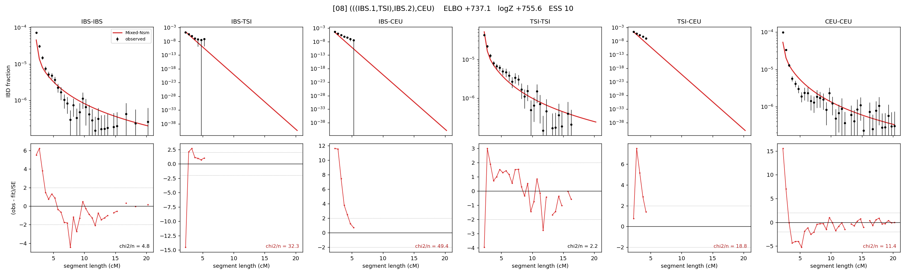

# `(((IBS.1,TSI),IBS.2),CEU)`

Model 08 of 21 | admixed leaf: **IBS** | 4 events, 8 nodes

## Model score

| quantity | value | |
|---|---|---|
| ELBO | +737.09 | +- 0.28 (MC) |
| logZ (importance sampling) | +755.61 | |
| ESS of the IS weights | 9.6 / 4000 | LOW -- treat logZ with suspicion |
| Stan dropped-constant correction | -25.77 | already applied |
| seed kept / runtime | 31 | 21 s |

## Events (in temporal order, most recent first)

| # | type | detail | time (gen) | cumulative |
|---|---|---|---|---|
| 1 | ADMIXTURE | IBS -> IBS.1 + IBS.2 | 1.0 +- 0.0 | 1.0 |
| 2 | MERGE | IBS.2 + TSI -> n1 | 225.6 +- 0.6 | 226.6 |
| 3 | MERGE | IBS.1 + n1 -> n2 | 2.5 +- 0.1 | 229.1 |
| 4 | MERGE | n2 + CEU -> root | 2.8 +- 0.1 | 231.9 |

## Admixture fraction

**f = 0.986 +- 0.000** (fraction from `IBS.1`; 0.014 from `IBS.2`)

Collapsed to a tree: one source carries <5% of the ancestry, so this graph is behaving as its no-admixture special case.

## Effective sizes (haploid)

| node | Ne | sd of log Ne |
|---|---|---|
| `IBS` | 565,916 | 0.10 |
| `TSI` | 511,050 | 0.13 |
| `CEU` | 377,912 | 0.11 |
| `IBS.1` | 633,503 | 0.09 |
| `IBS.2` | 2,174 | 0.06 |
| `n1` | 1,071 | 0.04 |
| `n2` | 944 | 0.04 |
| `root` | 860 | 0.04 |

log-Ne random-walk step scale tau = 1.574

## Fit quality by component

| component | log-likelihood | n terms | chi2/n |
|---|---|---|---|
| IBD | +820.8 | 110 | 11.69 |
| SNP | +49.2 | 6 | 2.33 |

chi2/n is the mean squared standardized residual: 1.0 = fits inside its own SEs. Do NOT compare the two log-likelihood LEVELS against each other -- different term counts and different units.

## SNP covariance residuals `(w_hat - W_pred)/w_se`

| | IBS | TSI | CEU |
|---|---|---|---|
| **IBS** | +0.91 | +0.04 | -0.84 |
| **TSI** | +0.04 | -0.12 | +0.11 |
| **CEU** | -0.84 | +0.11 | +0.33 |

