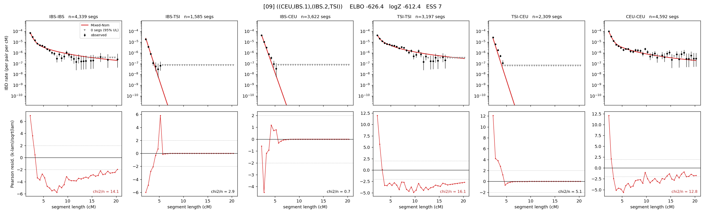

# `((CEU,IBS.1),(IBS.2,TSI))`

Model 09 of 21 | admixed leaf: **IBS** | 4 events, 8 nodes

## Model score

| quantity | value | |
|---|---|---|
| ELBO | -626.38 | +- 0.18 (MC) |
| logZ (importance sampling) | -612.41 | |
| ESS of the IS weights | 7.2 / 4000 | LOW -- treat logZ with suspicion |
| Stan dropped-constant correction | -25.77 | already applied |
| seed kept / runtime | 31 | 22 s |

## Events (in temporal order, most recent first)

| # | type | detail | time (gen) | cumulative |
|---|---|---|---|---|
| 1 | ADMIXTURE | IBS -> IBS.1 + IBS.2 | 121.3 +- 0.7 | 121.3 |
| 2 | MERGE | IBS.1 + TSI -> n1 | 10.3 +- 0.2 | 131.5 |
| 3 | MERGE | IBS.2 + CEU -> n2 | 16.8 +- 0.6 | 148.3 |
| 4 | MERGE | n1 + n2 -> root | 10.2 +- 0.1 | 158.5 |

## Admixture fraction

**f = 0.617 +- 0.004** (fraction from `IBS.1`; 0.383 from `IBS.2`)

## Effective sizes (haploid)

| node | Ne | sd of log Ne |
|---|---|---|
| `IBS` | 621,416 | 0.12 |
| `TSI` | 412,954 | 0.06 |
| `CEU` | 628,426 | 0.06 |
| `IBS.1` | 1,109,706 | 0.09 |
| `IBS.2` | 2,529 | 0.04 |
| `n1` | 1,003,678 | 0.08 |
| `n2` | 1,844 | 0.03 |
| `root` | 13,298 | 0.02 |

log-Ne random-walk step scale tau = 1.873

## Fit quality by component

| component | log-likelihood | n terms | chi2/n |
|---|---|---|---|
| IBD | -546.6 | 222 | 3.08 |
| SNP | +46.0 | 6 | 3.42 |

chi2/n is the mean squared standardized residual: 1.0 = fits inside its own SEs. Do NOT compare the two log-likelihood LEVELS against each other -- different term counts and different units.

## SNP covariance residuals `(w_hat - W_pred)/w_se`

| | IBS | TSI | CEU |
|---|---|---|---|
| **IBS** | +0.18 | -2.02 | +1.26 |
| **TSI** | -2.02 | +2.48 | -1.66 |
| **CEU** | +1.26 | -1.66 | +0.72 |

