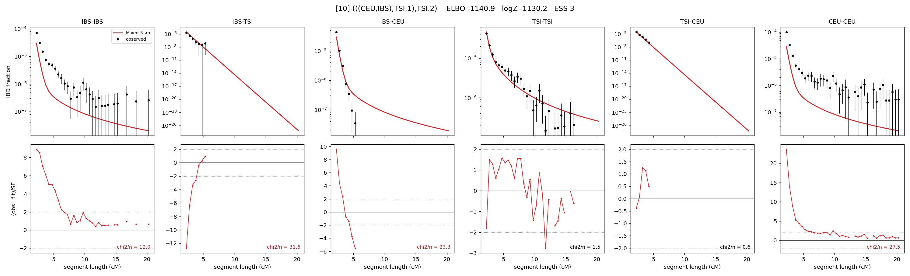

# `(((CEU,IBS),TSI.1),TSI.2)`

Model 10 of 21 | admixed leaf: **TSI** | 4 events, 8 nodes

> Graph where the two NON-admixed leaves merge first. Excluded by the 'first merge must involve an admixture branch' rule; included here because it is the standard local-clade + deep-source scenario.

## Model score

| quantity | value | |
|---|---|---|
| ELBO | -1140.94 | +- 0.14 (MC) |
| logZ (importance sampling) | -1130.21 | |
| ESS of the IS weights | 3.1 / 4000 | LOW -- treat logZ with suspicion |
| Stan dropped-constant correction | -25.77 | already applied |
| seed kept / runtime | 47 | 23 s |

## Events (in temporal order, most recent first)

| # | type | detail | time (gen) | cumulative |
|---|---|---|---|---|
| 1 | ADMIXTURE | TSI -> TSI.1 + TSI.2 | 1.0 +- 0.0 | 1.0 |
| 2 | MERGE | IBS + CEU -> n1 | 1.0 +- 0.0 | 2.0 |
| 3 | MERGE | TSI.2 + n1 -> n2 | 142.5 +- 1.3 | 144.5 |
| 4 | MERGE | TSI.1 + n2 -> root | 364.3 +- 1.8 | 508.8 |

## Admixture fraction

**f = 0.002 +- 0.000** (fraction from `TSI.1`; 0.998 from `TSI.2`)

Collapsed to a tree: one source carries <5% of the ancestry, so this graph is behaving as its no-admixture special case.

## Effective sizes (haploid)

| node | Ne | sd of log Ne |
|---|---|---|
| `IBS` | 6,404,388 | 0.29 |
| `TSI` | 500,388 | 0.07 |
| `CEU` | 6,376,461 | 0.29 |
| `TSI.1` | 1 | 0.04 |
| `TSI.2` | 513,286 | 0.07 |
| `n1` | 6,574,750 | 0.29 |
| `n2` | 16,553 | 0.04 |
| `root` | 14,389 | 0.02 |

log-Ne random-walk step scale tau = 1.546

## Fit quality by component

| component | log-likelihood | n terms | chi2/n |
|---|---|---|---|
| IBD | +567.1 | 110 | 15.90 |
| SNP | -1,557.2 | 6 | 537.80 |

chi2/n is the mean squared standardized residual: 1.0 = fits inside its own SEs. Do NOT compare the two log-likelihood LEVELS against each other -- different term counts and different units.

## SNP covariance residuals `(w_hat - W_pred)/w_se`

| | IBS | TSI | CEU |
|---|---|---|---|
| **IBS** | +23.16 | +17.68 | -33.18 |
| **TSI** | +17.68 | +9.01 | -16.82 |
| **CEU** | -33.18 | -16.82 | +30.13 |

