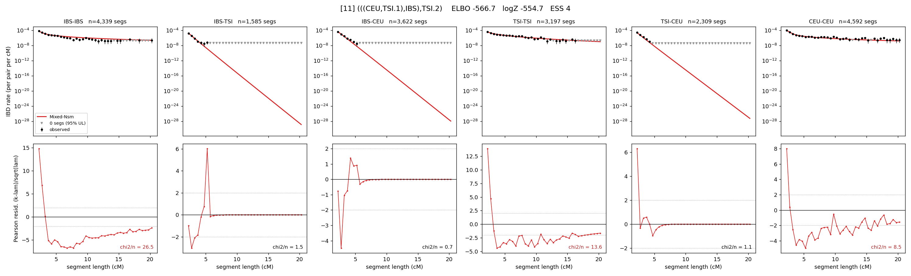

# `(((CEU,TSI.1),IBS),TSI.2)`

Model 11 of 21 | admixed leaf: **TSI** | 4 events, 8 nodes

## Model score

| quantity | value | |
|---|---|---|
| ELBO | -566.67 | +- 0.17 (MC) |
| logZ (importance sampling) | -554.74 | |
| ESS of the IS weights | 4.0 / 4000 | LOW -- treat logZ with suspicion |
| Stan dropped-constant correction | -25.77 | already applied |
| seed kept / runtime | 1 | 23 s |

## Events (in temporal order, most recent first)

| # | type | detail | time (gen) | cumulative |
|---|---|---|---|---|
| 1 | ADMIXTURE | TSI -> TSI.1 + TSI.2 | 11.5 +- 0.1 | 11.5 |
| 2 | MERGE | TSI.2 + CEU -> n1 | 132.3 +- 0.3 | 143.8 |
| 3 | MERGE | n1 + IBS -> n2 | 8.5 +- 0.2 | 152.3 |
| 4 | MERGE | TSI.1 + n2 -> root | 11.2 +- 0.2 | 163.5 |

## Admixture fraction

**f = 0.879 +- 0.001** (fraction from `TSI.1`; 0.121 from `TSI.2`)

## Effective sizes (haploid)

| node | Ne | sd of log Ne |
|---|---|---|
| `IBS` | 468,861 | 0.06 |
| `TSI` | 1,826,666 | 0.08 |
| `CEU` | 711,212 | 0.08 |
| `TSI.1` | 1,947,261 | 0.08 |
| `TSI.2` | 6,130 | 0.04 |
| `n1` | 2,359 | 0.03 |
| `n2` | 3,633 | 0.03 |
| `root` | 15,805 | 0.01 |

log-Ne random-walk step scale tau = 1.632

## Fit quality by component

| component | log-likelihood | n terms | chi2/n |
|---|---|---|---|
| IBD | -471.4 | 222 | 2.35 |
| SNP | +25.3 | 6 | 10.29 |

chi2/n is the mean squared standardized residual: 1.0 = fits inside its own SEs. Do NOT compare the two log-likelihood LEVELS against each other -- different term counts and different units.

## SNP covariance residuals `(w_hat - W_pred)/w_se`

| | IBS | TSI | CEU |
|---|---|---|---|
| **IBS** | -3.58 | +2.33 | +1.58 |
| **TSI** | +2.33 | +3.12 | -4.19 |
| **CEU** | +1.58 | -4.19 | +2.61 |

