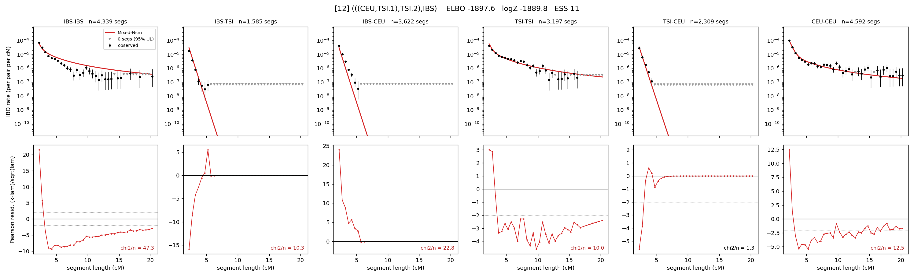

# `(((CEU,TSI.1),TSI.2),IBS)`

Model 12 of 21 | admixed leaf: **TSI** | 4 events, 8 nodes

## Model score

| quantity | value | |
|---|---|---|
| ELBO | -1897.62 | +- 0.09 (MC) |
| logZ (importance sampling) | -1889.75 | |
| ESS of the IS weights | 11.1 / 4000 | LOW -- treat logZ with suspicion |
| Stan dropped-constant correction | -25.77 | already applied |
| seed kept / runtime | 7 | 21 s |

## Events (in temporal order, most recent first)

| # | type | detail | time (gen) | cumulative |
|---|---|---|---|---|
| 1 | ADMIXTURE | TSI -> TSI.1 + TSI.2 | 11.7 +- 0.8 | 11.7 |
| 2 | MERGE | TSI.2 + CEU -> n1 | 115.1 +- 0.9 | 126.9 |
| 3 | MERGE | TSI.1 + n1 -> n2 | 30.0 +- 0.7 | 156.9 |
| 4 | MERGE | n2 + IBS -> root | 3.1 +- 0.4 | 160.0 |

## Admixture fraction

**f = 0.999 +- 0.000** (fraction from `TSI.1`; 0.001 from `TSI.2`)

Collapsed to a tree: one source carries <5% of the ancestry, so this graph is behaving as its no-admixture special case.

## Effective sizes (haploid)

| node | Ne | sd of log Ne |
|---|---|---|
| `IBS` | 329,590 | 0.03 |
| `TSI` | 548,169 | 0.10 |
| `CEU` | 654,470 | 0.03 |
| `TSI.1` | 411,218 | 0.04 |
| `TSI.2` | 7,691 | 0.36 |
| `n1` | 9,537 | 0.04 |
| `n2` | 7,374 | 0.07 |
| `root` | 9,582 | 0.03 |

log-Ne random-walk step scale tau = 1.356

## Fit quality by component

| component | log-likelihood | n terms | chi2/n |
|---|---|---|---|
| IBD | -1,234.5 | 222 | 9.63 |
| SNP | -553.8 | 6 | 203.33 |

chi2/n is the mean squared standardized residual: 1.0 = fits inside its own SEs. Do NOT compare the two log-likelihood LEVELS against each other -- different term counts and different units.

## SNP covariance residuals `(w_hat - W_pred)/w_se`

| | IBS | TSI | CEU |
|---|---|---|---|
| **IBS** | +2.92 | -18.77 | +10.55 |
| **TSI** | -18.77 | +22.14 | -14.52 |
| **CEU** | +10.55 | -14.52 | +6.52 |

