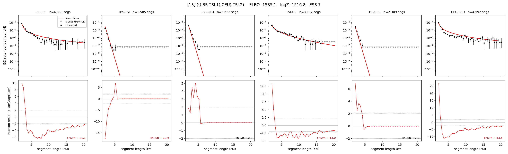

# `(((IBS,TSI.1),CEU),TSI.2)`

Model 13 of 21 | admixed leaf: **TSI** | 4 events, 8 nodes

## Model score

| quantity | value | |
|---|---|---|
| ELBO | -1535.06 | +- 0.31 (MC) |
| logZ (importance sampling) | -1516.81 | |
| ESS of the IS weights | 7.0 / 4000 | LOW -- treat logZ with suspicion |
| Stan dropped-constant correction | -25.77 | already applied |
| seed kept / runtime | 1 | 23 s |

## Events (in temporal order, most recent first)

| # | type | detail | time (gen) | cumulative |
|---|---|---|---|---|
| 1 | ADMIXTURE | TSI -> TSI.1 + TSI.2 | 10.3 +- 0.5 | 10.3 |
| 2 | MERGE | TSI.2 + IBS -> n1 | 169.4 +- 1.1 | 179.7 |
| 3 | MERGE | n1 + CEU -> n2 | 1.8 +- 0.0 | 181.4 |
| 4 | MERGE | TSI.1 + n2 -> root | 9.7 +- 0.3 | 191.1 |

## Admixture fraction

**f = 0.446 +- 0.008** (fraction from `TSI.1`; 0.554 from `TSI.2`)

## Effective sizes (haploid)

| node | Ne | sd of log Ne |
|---|---|---|
| `IBS` | 515,117 | 0.05 |
| `TSI` | 3,020,790 | 0.30 |
| `CEU` | 301,872 | 0.05 |
| `TSI.1` | 41,400,185 | 0.66 |
| `TSI.2` | 115,564 | 0.05 |
| `n1` | 813 | 0.05 |
| `n2` | 895 | 0.06 |
| `root` | 82,865 | 0.06 |

log-Ne random-walk step scale tau = 2.338

## Fit quality by component

| component | log-likelihood | n terms | chi2/n |
|---|---|---|---|
| IBD | -1,046.5 | 222 | 7.56 |
| SNP | -328.8 | 6 | 128.35 |

chi2/n is the mean squared standardized residual: 1.0 = fits inside its own SEs. Do NOT compare the two log-likelihood LEVELS against each other -- different term counts and different units.

## SNP covariance residuals `(w_hat - W_pred)/w_se`

| | IBS | TSI | CEU |
|---|---|---|---|
| **IBS** | -5.25 | +14.25 | -5.29 |
| **TSI** | +14.25 | +8.41 | -14.72 |
| **CEU** | -5.29 | -14.72 | +14.56 |

