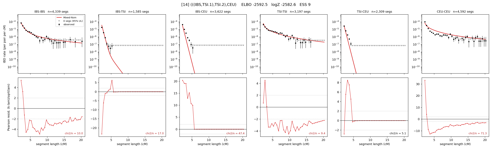

# `(((IBS,TSI.1),TSI.2),CEU)`

Model 14 of 21 | admixed leaf: **TSI** | 4 events, 8 nodes

## Model score

| quantity | value | |
|---|---|---|
| ELBO | -2592.48 | +- 0.16 (MC) |
| logZ (importance sampling) | -2582.57 | |
| ESS of the IS weights | 8.7 / 4000 | LOW -- treat logZ with suspicion |
| Stan dropped-constant correction | -25.77 | already applied |
| seed kept / runtime | 13 | 22 s |

## Events (in temporal order, most recent first)

| # | type | detail | time (gen) | cumulative |
|---|---|---|---|---|
| 1 | ADMIXTURE | TSI -> TSI.1 + TSI.2 | 10.6 +- 0.1 | 10.6 |
| 2 | MERGE | TSI.2 + IBS -> n1 | 57.0 +- 0.7 | 67.7 |
| 3 | MERGE | TSI.1 + n1 -> n2 | 131.3 +- 1.0 | 199.0 |
| 4 | MERGE | n2 + CEU -> root | 2.3 +- 0.1 | 201.3 |

## Admixture fraction

**f = 0.998 +- 0.000** (fraction from `TSI.1`; 0.002 from `TSI.2`)

Collapsed to a tree: one source carries <5% of the ancestry, so this graph is behaving as its no-admixture special case.

## Effective sizes (haploid)

| node | Ne | sd of log Ne |
|---|---|---|
| `IBS` | 816,702 | 0.04 |
| `TSI` | 708,488 | 0.04 |
| `CEU` | 263,106 | 0.04 |
| `TSI.1` | 400,105 | 0.04 |
| `TSI.2` | 99,655 | 0.04 |
| `n1` | 109,282 | 0.04 |
| `n2` | 1,307 | 0.02 |
| `root` | 2,194 | 0.01 |

log-Ne random-walk step scale tau = 1.791

## Fit quality by component

| component | log-likelihood | n terms | chi2/n |
|---|---|---|---|
| IBD | -1,958.4 | 222 | 22.07 |
| SNP | -497.5 | 6 | 184.57 |

chi2/n is the mean squared standardized residual: 1.0 = fits inside its own SEs. Do NOT compare the two log-likelihood LEVELS against each other -- different term counts and different units.

## SNP covariance residuals `(w_hat - W_pred)/w_se`

| | IBS | TSI | CEU |
|---|---|---|---|
| **IBS** | -0.81 | -8.69 | +6.83 |
| **TSI** | -8.69 | +22.08 | -18.80 |
| **CEU** | +6.83 | -18.80 | +11.84 |

