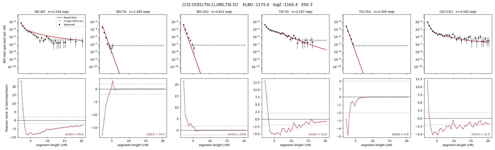

# `((CEU,TSI.1),(IBS,TSI.2))`

Model 15 of 21 | admixed leaf: **TSI** | 4 events, 8 nodes

## Model score

| quantity | value | |
|---|---|---|
| ELBO | -1175.01 | +- 0.12 (MC) |
| logZ (importance sampling) | -1165.45 | |
| ESS of the IS weights | 3.1 / 4000 | LOW -- treat logZ with suspicion |
| Stan dropped-constant correction | -25.77 | already applied |
| seed kept / runtime | 1 | 22 s |

## Events (in temporal order, most recent first)

| # | type | detail | time (gen) | cumulative |
|---|---|---|---|---|
| 1 | ADMIXTURE | TSI -> TSI.1 + TSI.2 | 22.5 +- 0.8 | 22.5 |
| 2 | MERGE | TSI.1 + IBS -> n1 | 106.8 +- 0.4 | 129.3 |
| 3 | MERGE | TSI.2 + CEU -> n2 | 9.3 +- 0.1 | 138.7 |
| 4 | MERGE | n1 + n2 -> root | 6.1 +- 0.1 | 144.8 |

## Admixture fraction

**f = 0.989 +- 0.000** (fraction from `TSI.1`; 0.011 from `TSI.2`)

Collapsed to a tree: one source carries <5% of the ancestry, so this graph is behaving as its no-admixture special case.

## Effective sizes (haploid)

| node | Ne | sd of log Ne |
|---|---|---|
| `IBS` | 356,062 | 0.04 |
| `TSI` | 12,635,997 | 0.11 |
| `CEU` | 679,093 | 0.05 |
| `TSI.1` | 5,691,123 | 0.12 |
| `TSI.2` | 5 | 0.04 |
| `n1` | 1,215,976 | 0.03 |
| `n2` | 1,763 | 0.02 |
| `root` | 15,004 | 0.01 |

log-Ne random-walk step scale tau = 2.168

## Fit quality by component

| component | log-likelihood | n terms | chi2/n |
|---|---|---|---|
| IBD | -1,075.5 | 222 | 7.38 |
| SNP | +52.9 | 6 | 1.09 |

chi2/n is the mean squared standardized residual: 1.0 = fits inside its own SEs. Do NOT compare the two log-likelihood LEVELS against each other -- different term counts and different units.

## SNP covariance residuals `(w_hat - W_pred)/w_se`

| | IBS | TSI | CEU |
|---|---|---|---|
| **IBS** | +0.13 | +0.24 | -0.28 |
| **TSI** | +0.24 | +0.22 | -0.33 |
| **CEU** | -0.28 | -0.33 | +0.41 |

