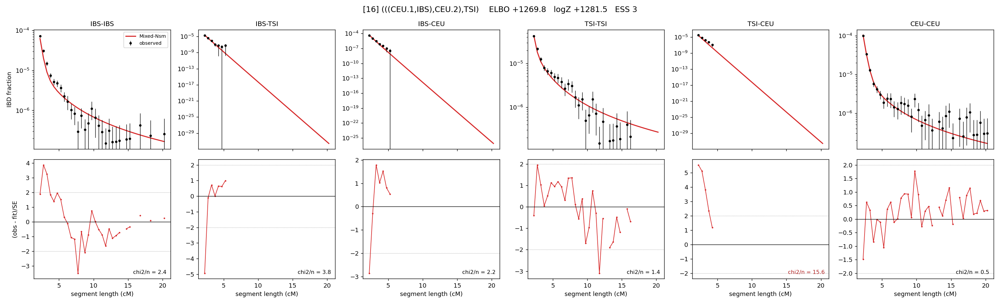

# `(((CEU.1,IBS),CEU.2),TSI)`

Model 16 of 21 | admixed leaf: **CEU** | 4 events, 8 nodes

## Model score

| quantity | value | |
|---|---|---|
| ELBO | +1269.79 | +- 0.15 (MC) |
| logZ (importance sampling) | +1281.55 | |
| ESS of the IS weights | 3.0 / 4000 | LOW -- treat logZ with suspicion |
| Stan dropped-constant correction | -25.77 | already applied |
| seed kept / runtime | 7 | 21 s |

## Events (in temporal order, most recent first)

| # | type | detail | time (gen) | cumulative |
|---|---|---|---|---|
| 1 | ADMIXTURE | CEU -> CEU.1 + CEU.2 | 129.8 +- 0.9 | 129.8 |
| 2 | MERGE | CEU.2 + IBS -> n1 | 8.2 +- 0.5 | 138.0 |
| 3 | MERGE | CEU.1 + n1 -> n2 | 32.7 +- 2.1 | 170.7 |
| 4 | MERGE | n2 + TSI -> root | 1.0 +- 0.0 | 171.7 |

## Admixture fraction

**f = 0.120 +- 0.003** (fraction from `CEU.1`; 0.880 from `CEU.2`)

## Effective sizes (haploid)

| node | Ne | sd of log Ne |
|---|---|---|
| `IBS` | 739,233 | 0.08 |
| `TSI` | 462,660 | 0.10 |
| `CEU` | 756,982 | 0.14 |
| `CEU.1` | 170 | 0.05 |
| `CEU.2` | 23,315 | 0.12 |
| `n1` | 13,730 | 0.08 |
| `n2` | 7,807 | 0.04 |
| `root` | 8,655 | 0.04 |

log-Ne random-walk step scale tau = 1.611

## Fit quality by component

| component | log-likelihood | n terms | chi2/n |
|---|---|---|---|
| IBD | +1,337.5 | 110 | 2.36 |
| SNP | +50.9 | 6 | 1.78 |

chi2/n is the mean squared standardized residual: 1.0 = fits inside its own SEs. Do NOT compare the two log-likelihood LEVELS against each other -- different term counts and different units.

## SNP covariance residuals `(w_hat - W_pred)/w_se`

| | IBS | TSI | CEU |
|---|---|---|---|
| **IBS** | -0.71 | +0.07 | +0.59 |
| **TSI** | +0.07 | +0.94 | -0.99 |
| **CEU** | +0.59 | -0.99 | +0.51 |

