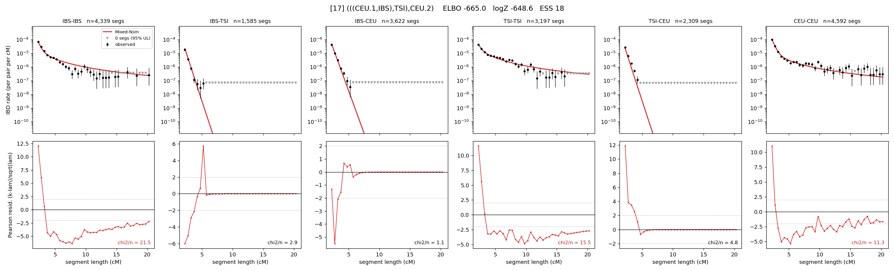

# `(((CEU.1,IBS),TSI),CEU.2)`

Model 17 of 21 | admixed leaf: **CEU** | 4 events, 8 nodes

## Model score

| quantity | value | |
|---|---|---|
| ELBO | -664.98 | +- 0.29 (MC) |
| logZ (importance sampling) | -648.65 | |
| ESS of the IS weights | 17.9 / 4000 | LOW -- treat logZ with suspicion |
| Stan dropped-constant correction | -25.77 | already applied |
| seed kept / runtime | 7 | 23 s |

## Events (in temporal order, most recent first)

| # | type | detail | time (gen) | cumulative |
|---|---|---|---|---|
| 1 | ADMIXTURE | CEU -> CEU.1 + CEU.2 | 141.5 +- 0.6 | 141.5 |
| 2 | MERGE | CEU.2 + IBS -> n1 | 1.8 +- 0.1 | 143.4 |
| 3 | MERGE | n1 + TSI -> n2 | 13.2 +- 0.4 | 156.6 |
| 4 | MERGE | CEU.1 + n2 -> root | 1.3 +- 0.0 | 157.9 |

## Admixture fraction

**f = 0.175 +- 0.013** (fraction from `CEU.1`; 0.825 from `CEU.2`)

## Effective sizes (haploid)

| node | Ne | sd of log Ne |
|---|---|---|
| `IBS` | 513,456 | 0.05 |
| `TSI` | 418,696 | 0.05 |
| `CEU` | 661,662 | 0.09 |
| `CEU.1` | 145 | 0.07 |
| `CEU.2` | 5,859 | 0.03 |
| `n1` | 5,641 | 0.02 |
| `n2` | 17,216 | 0.03 |
| `root` | 13,904 | 0.01 |

log-Ne random-walk step scale tau = 2.032

## Fit quality by component

| component | log-likelihood | n terms | chi2/n |
|---|---|---|---|
| IBD | -557.8 | 222 | 3.11 |
| SNP | +27.6 | 6 | 9.54 |

chi2/n is the mean squared standardized residual: 1.0 = fits inside its own SEs. Do NOT compare the two log-likelihood LEVELS against each other -- different term counts and different units.

## SNP covariance residuals `(w_hat - W_pred)/w_se`

| | IBS | TSI | CEU |
|---|---|---|---|
| **IBS** | -2.71 | -0.26 | +2.61 |
| **TSI** | -0.26 | +3.56 | -3.52 |
| **CEU** | +2.61 | -3.52 | +1.55 |

