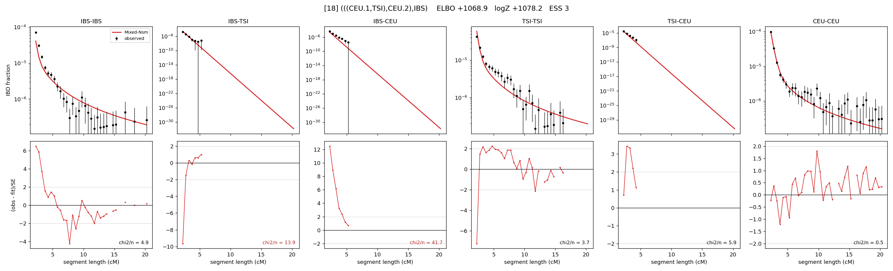

# `(((CEU.1,TSI),CEU.2),IBS)`

Model 18 of 21 | admixed leaf: **CEU** | 4 events, 8 nodes

## Model score

| quantity | value | |
|---|---|---|
| ELBO | +1068.87 | +- 0.10 (MC) |
| logZ (importance sampling) | +1078.22 | |
| ESS of the IS weights | 3.5 / 4000 | LOW -- treat logZ with suspicion |
| Stan dropped-constant correction | -25.77 | already applied |
| seed kept / runtime | 47 | 21 s |

## Events (in temporal order, most recent first)

| # | type | detail | time (gen) | cumulative |
|---|---|---|---|---|
| 1 | ADMIXTURE | CEU -> CEU.1 + CEU.2 | 113.2 +- 0.8 | 113.2 |
| 2 | MERGE | CEU.2 + TSI -> n1 | 51.5 +- 1.3 | 164.7 |
| 3 | MERGE | CEU.1 + n1 -> n2 | 7.9 +- 0.4 | 172.6 |
| 4 | MERGE | n2 + IBS -> root | 1.2 +- 0.0 | 173.8 |

## Admixture fraction

**f = 0.986 +- 0.002** (fraction from `CEU.1`; 0.014 from `CEU.2`)

Collapsed to a tree: one source carries <5% of the ancestry, so this graph is behaving as its no-admixture special case.

## Effective sizes (haploid)

| node | Ne | sd of log Ne |
|---|---|---|
| `IBS` | 643,636 | 0.11 |
| `TSI` | 621,451 | 0.11 |
| `CEU` | 777,218 | 0.07 |
| `CEU.1` | 16,331 | 0.03 |
| `CEU.2` | 2,589 | 0.35 |
| `n1` | 3,367 | 0.04 |
| `n2` | 7,049 | 0.03 |
| `root` | 6,893 | 0.03 |

log-Ne random-walk step scale tau = 1.496

## Fit quality by component

| component | log-likelihood | n terms | chi2/n |
|---|---|---|---|
| IBD | +1,127.6 | 110 | 6.23 |
| SNP | +50.7 | 6 | 1.82 |

chi2/n is the mean squared standardized residual: 1.0 = fits inside its own SEs. Do NOT compare the two log-likelihood LEVELS against each other -- different term counts and different units.

## SNP covariance residuals `(w_hat - W_pred)/w_se`

| | IBS | TSI | CEU |
|---|---|---|---|
| **IBS** | -0.69 | -0.26 | +0.81 |
| **TSI** | -0.26 | +1.16 | -1.07 |
| **CEU** | +0.81 | -1.07 | +0.46 |

