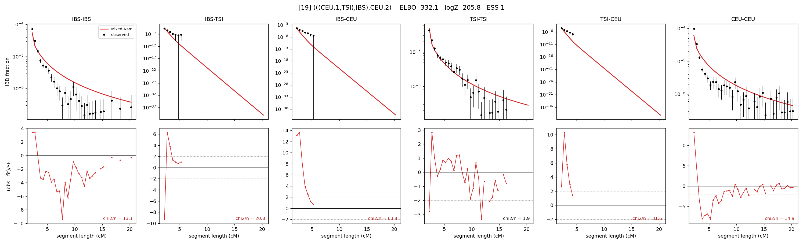

# `(((CEU.1,TSI),IBS),CEU.2)`

Model 19 of 21 | admixed leaf: **CEU** | 4 events, 8 nodes

## Model score

| quantity | value | |
|---|---|---|
| ELBO | -332.12 | +- 2.30 (MC) |
| logZ (importance sampling) | -205.80 | |
| ESS of the IS weights | 1.2 / 4000 | LOW -- treat logZ with suspicion |
| Stan dropped-constant correction | -25.77 | already applied |
| seed kept / runtime | 31 | 23 s |

## Events (in temporal order, most recent first)

| # | type | detail | time (gen) | cumulative |
|---|---|---|---|---|
| 1 | ADMIXTURE | CEU -> CEU.1 + CEU.2 | 1.0 +- 0.0 | 1.0 |
| 2 | MERGE | CEU.2 + TSI -> n1 | 209.2 +- 2.3 | 210.2 |
| 3 | MERGE | n1 + IBS -> n2 | 9.4 +- 0.7 | 219.6 |
| 4 | MERGE | CEU.1 + n2 -> root | 106.7 +- 2.0 | 326.3 |

## Admixture fraction

**f = 0.623 +- 0.001** (fraction from `CEU.1`; 0.377 from `CEU.2`)

## Effective sizes (haploid)

| node | Ne | sd of log Ne |
|---|---|---|
| `IBS` | 337,653 | 0.19 |
| `TSI` | 437,566 | 0.13 |
| `CEU` | 171,250 | 0.15 |
| `CEU.1` | 191,042 | 0.16 |
| `CEU.2` | 95,704 | 0.15 |
| `n1` | 48,713 | 0.15 |
| `n2` | 38,400 | 0.15 |
| `root` | 5 | 0.07 |

log-Ne random-walk step scale tau = 2.260

## Fit quality by component

| component | log-likelihood | n terms | chi2/n |
|---|---|---|---|
| IBD | +517.7 | 110 | 16.94 |
| SNP | -670.8 | 6 | 242.33 |

chi2/n is the mean squared standardized residual: 1.0 = fits inside its own SEs. Do NOT compare the two log-likelihood LEVELS against each other -- different term counts and different units.

## SNP covariance residuals `(w_hat - W_pred)/w_se`

| | IBS | TSI | CEU |
|---|---|---|---|
| **IBS** | +10.44 | -10.50 | -2.01 |
| **TSI** | -10.50 | +23.35 | -19.32 |
| **CEU** | -2.01 | -19.32 | +16.65 |

