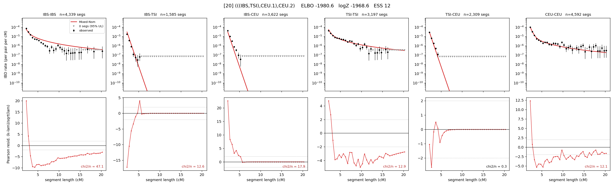

# `(((IBS,TSI),CEU.1),CEU.2)`

Model 20 of 21 | admixed leaf: **CEU** | 4 events, 8 nodes

> Graph where the two NON-admixed leaves merge first. Excluded by the 'first merge must involve an admixture branch' rule; included here because it is the standard local-clade + deep-source scenario.

## Model score

| quantity | value | |
|---|---|---|
| ELBO | -1980.58 | +- 0.21 (MC) |
| logZ (importance sampling) | -1968.57 | |
| ESS of the IS weights | 11.6 / 4000 | LOW -- treat logZ with suspicion |
| Stan dropped-constant correction | -25.77 | already applied |
| seed kept / runtime | 7 | 15 s |

## Events (in temporal order, most recent first)

| # | type | detail | time (gen) | cumulative |
|---|---|---|---|---|
| 1 | ADMIXTURE | CEU -> CEU.1 + CEU.2 | 130.3 +- 0.7 | 130.3 |
| 2 | MERGE | IBS + TSI -> n1 | 19.4 +- 0.4 | 149.7 |
| 3 | MERGE | CEU.2 + n1 -> n2 | 1.1 +- 0.0 | 150.8 |
| 4 | MERGE | CEU.1 + n2 -> root | 2.3 +- 0.1 | 153.1 |

## Admixture fraction

**f = 0.015 +- 0.002** (fraction from `CEU.1`; 0.985 from `CEU.2`)

Collapsed to a tree: one source carries <5% of the ancestry, so this graph is behaving as its no-admixture special case.

## Effective sizes (haploid)

| node | Ne | sd of log Ne |
|---|---|---|
| `IBS` | 320,639 | 0.08 |
| `TSI` | 401,777 | 0.04 |
| `CEU` | 667,531 | 0.05 |
| `CEU.1` | 12,302 | 0.10 |
| `CEU.2` | 6,015 | 0.04 |
| `n1` | 35,800 | 0.07 |
| `n2` | 22,484 | 0.05 |
| `root` | 12,218 | 0.02 |

log-Ne random-walk step scale tau = 1.583

## Fit quality by component

| component | log-likelihood | n terms | chi2/n |
|---|---|---|---|
| IBD | -1,172.1 | 222 | 8.34 |
| SNP | -692.2 | 6 | 249.47 |

chi2/n is the mean squared standardized residual: 1.0 = fits inside its own SEs. Do NOT compare the two log-likelihood LEVELS against each other -- different term counts and different units.

## SNP covariance residuals `(w_hat - W_pred)/w_se`

| | IBS | TSI | CEU |
|---|---|---|---|
| **IBS** | +9.88 | -24.74 | +8.49 |
| **TSI** | -24.74 | +22.76 | -12.58 |
| **CEU** | +8.49 | -12.58 | +5.97 |

