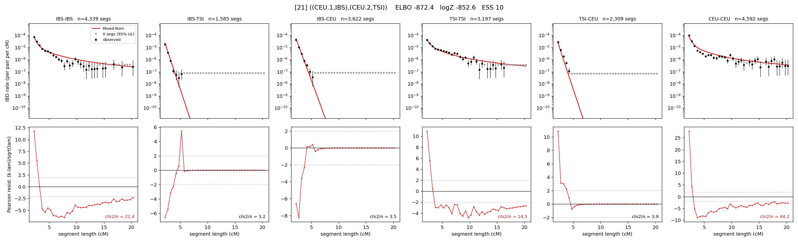

# `((CEU.1,IBS),(CEU.2,TSI))`

Model 21 of 21 | admixed leaf: **CEU** | 4 events, 8 nodes

## Model score

| quantity | value | |
|---|---|---|
| ELBO | -872.37 | +- 0.33 (MC) |
| logZ (importance sampling) | -852.61 | |
| ESS of the IS weights | 10.0 / 4000 | LOW -- treat logZ with suspicion |
| Stan dropped-constant correction | -25.77 | already applied |
| seed kept / runtime | 1 | 21 s |

## Events (in temporal order, most recent first)

| # | type | detail | time (gen) | cumulative |
|---|---|---|---|---|
| 1 | ADMIXTURE | CEU -> CEU.1 + CEU.2 | 1.7 +- 0.2 | 1.7 |
| 2 | MERGE | CEU.1 + IBS -> n1 | 142.2 +- 0.8 | 143.9 |
| 3 | MERGE | CEU.2 + TSI -> n2 | 10.5 +- 0.6 | 154.3 |
| 4 | MERGE | n1 + n2 -> root | 1.2 +- 0.1 | 155.6 |

## Admixture fraction

**f = 0.997 +- 0.000** (fraction from `CEU.1`; 0.003 from `CEU.2`)

Collapsed to a tree: one source carries <5% of the ancestry, so this graph is behaving as its no-admixture special case.

## Effective sizes (haploid)

| node | Ne | sd of log Ne |
|---|---|---|
| `IBS` | 496,597 | 0.09 |
| `TSI` | 428,659 | 0.05 |
| `CEU` | 380,197 | 0.08 |
| `CEU.1` | 393,735 | 0.08 |
| `CEU.2` | 0 | 0.09 |
| `n1` | 5,176 | 0.06 |
| `n2` | 13,619 | 0.03 |
| `root` | 14,240 | 0.01 |

log-Ne random-walk step scale tau = 1.871

## Fit quality by component

| component | log-likelihood | n terms | chi2/n |
|---|---|---|---|
| IBD | -777.0 | 222 | 4.86 |
| SNP | +48.3 | 6 | 2.63 |

chi2/n is the mean squared standardized residual: 1.0 = fits inside its own SEs. Do NOT compare the two log-likelihood LEVELS against each other -- different term counts and different units.

## SNP covariance residuals `(w_hat - W_pred)/w_se`

| | IBS | TSI | CEU |
|---|---|---|---|
| **IBS** | +1.48 | -1.29 | -0.43 |
| **TSI** | -1.29 | +0.09 | +0.47 |
| **CEU** | -0.43 | +0.47 | -0.16 |

