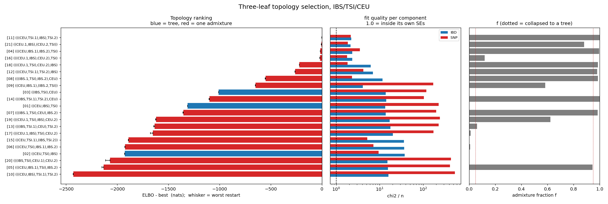

# Topology selection on IBS / TSI / CEU

21 models (3 trees + 18 one-admixture graphs), `mixed_model_Nsmooth`, Pathfinder with 6+ seeds, best ELBO kept.

## Ranking

| rank | topology | adm | ELBO | dELBO | restart range | ESS | chi2/n IBD | chi2/n SNP | f | P_model | P_argmax |
|---|---|---|---|---|---|---|---|---|---|---|---|
| 1 | [`(((CEU,TSI.1),IBS),TSI.2)`](../11_(((CEU,TSI.1),IBS),TSI.2)/report.md) | 1 | +1288.2 | +0.0 | 2.1 | 4.5 | 2.22 | 2.17 | 1.000 | 0.984 | 1.000 |
| 2 | [`((CEU.1,IBS),(CEU.2,TSI))`](../21_((CEU.1,IBS),(CEU.2,TSI))/report.md) | 1 | +1284.1 | -4.1 | 2.5 | 1.0 | 2.15 | 1.85 | 0.880 | 0.016 | 0.000 |
| 3 | [`(((CEU,IBS.1),IBS.2),TSI)`](../04_(((CEU,IBS.1),IBS.2),TSI)/report.md) | 1 | +1272.8 | -15.4 | 1.1 | 1.3 | 2.36 | 3.52 | 0.995 | 0.000 | 0.000 |
| 4 | [`(((CEU.1,IBS),CEU.2),TSI)`](../16_(((CEU.1,IBS),CEU.2),TSI)/report.md) | 1 | +1269.8 | -18.4 | 1.3 | 3.0 | 2.36 | 1.78 | 0.120 | 0.000 | 0.000 |
| 5 | [`(((CEU.1,TSI),CEU.2),IBS)`](../18_(((CEU.1,TSI),CEU.2),IBS)/report.md) | 1 | +1068.9 | -219.3 | 1.8 | 3.5 | 6.23 | 1.82 | 0.986 | 0.000 | 0.000 |
| 6 | [`(((CEU,TSI.1),TSI.2),IBS)`](../12_(((CEU,TSI.1),TSI.2),IBS)/report.md) | 1 | +1025.8 | -262.4 | 2.2 | 9.3 | 7.00 | 4.25 | 0.980 | 0.000 | 0.000 |
| 7 | [`(((IBS.1,TSI),IBS.2),CEU)`](../08_(((IBS.1,TSI),IBS.2),CEU)/report.md) | 1 | +737.1 | -551.1 | 3.2 | 9.6 | 11.69 | 2.33 | 0.986 | 0.000 | 0.000 |
| 8 | [`((CEU,IBS.1),(IBS.2,TSI))`](../09_((CEU,IBS.1),(IBS.2,TSI))/report.md) | 1 | +640.3 | -647.8 | 4.2 | 1.1 | 4.10 | 171.62 | 0.583 | 0.000 | 0.000 |
| 9 | [`((IBS,TSI),CEU)`](../03_((IBS,TSI),CEU)/report.md) | 0 | +278.5 | -1009.6 | 0.7 | 4.5 | 13.75 | 118.48 | - | 0.000 | 0.000 |
| 10 | [`(((IBS,TSI.1),TSI.2),CEU)`](../14_(((IBS,TSI.1),TSI.2),CEU)/report.md) | 1 | +190.4 | -1097.8 | 4.5 | 3.6 | 14.26 | 103.96 | 1.000 | 0.000 | 0.000 |
| 11 | [`((CEU,IBS),TSI)`](../01_((CEU,IBS),TSI)/report.md) | 0 | -23.8 | -1312.0 | 1.3 | 2.5 | 13.50 | 228.05 | - | 0.000 | 0.000 |
| 12 | [`(((IBS.1,TSI),CEU),IBS.2)`](../07_(((IBS.1,TSI),CEU),IBS.2)/report.md) | 1 | -64.9 | -1353.1 | 4.4 | 2.6 | 13.86 | 199.10 | 0.985 | 0.000 | 0.000 |
| 13 | [`(((CEU.1,TSI),IBS),CEU.2)`](../19_(((CEU.1,TSI),IBS),CEU.2)/report.md) | 1 | -332.1 | -1620.3 | 5.5 | 1.2 | 16.94 | 242.33 | 0.623 | 0.000 | 0.000 |
| 14 | [`(((IBS,TSI.1),CEU),TSI.2)`](../13_(((IBS,TSI.1),CEU),TSI.2)/report.md) | 1 | -347.0 | -1635.1 | 8.8 | 8.9 | 17.64 | 226.91 | 0.061 | 0.000 | 0.000 |
| 15 | [`(((CEU.1,IBS),TSI),CEU.2)`](../17_(((CEU.1,IBS),TSI),CEU.2)/report.md) | 1 | -364.4 | -1652.5 | 24.3 | 2.5 | 20.25 | 172.83 | 0.011 | 0.000 | 0.000 |
| 16 | [`((CEU,TSI.1),(IBS,TSI.2))`](../15_((CEU,TSI.1),(IBS,TSI.2))/report.md) | 1 | -601.6 | -1889.8 | 1.3 | 1.4 | 36.33 | 5.23 | 0.002 | 0.000 | 0.000 |
| 17 | [`(((CEU,TSI),IBS.1),IBS.2)`](../06_(((CEU,TSI),IBS.1),IBS.2)/report.md) | 1 | -636.0 | -1924.2 | 1.1 | 3.3 | 36.65 | 7.17 | 0.009 | 0.000 | 0.000 |
| 18 | [`((CEU,TSI),IBS)`](../02_((CEU,TSI),IBS)/report.md) | 0 | -637.5 | -1925.7 | 2.4 | 58.1 | 37.65 | 9.46 | - | 0.000 | 0.000 |
| 19 | [`(((IBS,TSI),CEU.1),CEU.2)`](../20_(((IBS,TSI),CEU.1),CEU.2)/report.md) | 1 | -782.1 | -2070.3 | 44.1 | 1.2 | 15.19 | 440.05 | 0.003 | 0.000 | 0.000 |
| 20 | [`(((CEU,IBS.1),TSI),IBS.2)`](../05_(((CEU,IBS.1),TSI),IBS.2)/report.md) | 1 | -845.7 | -2133.9 | 16.2 | 2.2 | 15.47 | 416.00 | 0.944 | 0.000 | 0.000 |
| 21 | [`(((CEU,IBS),TSI.1),TSI.2)`](../10_(((CEU,IBS),TSI.1),TSI.2)/report.md) | 1 | -1140.9 | -2429.1 | 1.3 | 3.1 | 15.90 | 537.80 | 0.002 | 0.000 | 0.000 |

## Selection

- **Best model: `(((CEU,TSI.1),IBS),TSI.2)`**, ELBO +1288.2, P_model = 0.984, P_argmax = 1.000.
- Runner-up `((CEU.1,IBS),(CEU.2,TSI))` is -4.1 nats behind. The winner's 6 restarts span 2.1 nats, and **6 of them beat the runner-up's best restart** -- the lead does not depend on the restart budget.
- Best tree `((IBS,TSI),CEU)` vs best admixture graph `(((CEU,TSI.1),IBS),TSI.2)`: +1009.6 nats for 3 extra Ne, 2 extra times and 1 fraction.

## How to read the two probabilities

`P_model` is softmax over the 21 ELBOs with a uniform model prior -- the posterior model probability. `P_argmax` bootstraps the Pathfinder draws and counts how often each model wins, so it measures only whether the RANKING is stable against Monte Carlo error. Both saturate at 1.000/0.000 whenever the gaps exceed a few nats, which they do here; the informative number is dELBO.

## Caveats that travel with these numbers

1. The ELBO is a lower bound on log Z and the gap KL(q||p) differs per model, so a model whose posterior happens to be more Gaussian is rewarded for that alone. The importance-sampling `logZ` would correct it, but the ESS column shows the weights are degenerate (max ESS 58 of 4000), so `logZ` cannot be trusted here either.
2. An admixture graph splits the admixed leaf into two source branches with separate Ne -- it buys a piecewise Ne, which these data independently want. A win by an admixture graph is evidence for non-constant Ne at least as much as for admixture, and three leaves cannot separate the two. Check each folder's residual row for a monotone tilt before reading any result as admixture.
3. These probabilities are conditional on the 21 listed models being the whole hypothesis space. Two admixture events, and non-constant Ne without admixture, are not in it.
